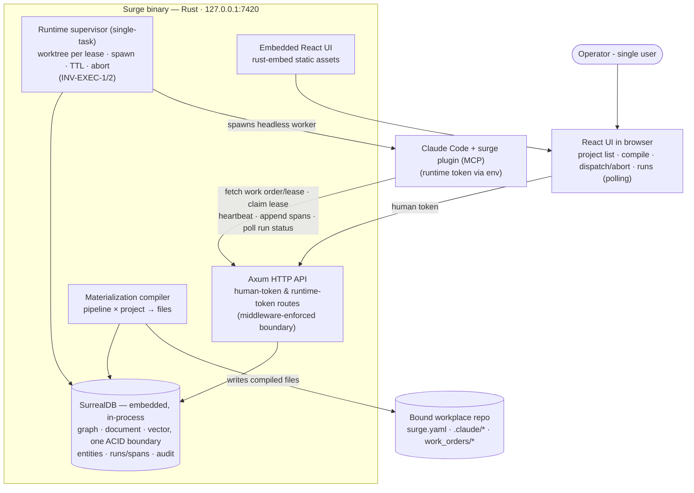

# Phase 0 — The materialization loop

**Status:** not_started
**Commitment level:** Phase 0 — ships to its real user (the operator) immediately; nothing here is throwaway.
**Time horizon:** ~3 weeks

## Purpose

Prove the product's central bet with the thinnest real slice: a pipeline stored in Surge compiles to a hashed materialization, the compiled files land in a bound repo, a real IDE runtime (Claude Code) executes under it and appends spans that show up in Surge — **and** Surge itself can dispatch one headless worker, hold its lease, and abort it. If this loop doesn't work — technically or ergonomically — the canvas, boards and observatory are decoration. **Riskiest assumptions tested** (revised 2026-08-12): (1) Surge's runtime supervisor can spawn a headless `claude -p` worker for a dispatched issue and get spans back (INV-EXEC-1 — the actuator, without which all of §06 is fiction); (2) the compiled materialization drives a real session, with the runtime-token API (five capabilities, INV-AUTH-1) carrying work order, lease, heartbeats, spans and the abort-status poll. Compiling config files that Claude Code reads is near-certain to work; spawning and supervising is not — so it is proven first, even ugly.

No visual editor in this phase: pipelines are defined as data (checked-in JSON/Rust fixtures). The editor is Phase 1.

## In scope

1. Cargo workspace scaffold (`crates/domain`, `crates/store`, `crates/server`, `ui/`) with `ts-rs` generation wired, and the embedded SurrealDB build budget measured and recorded (ADR-2).
2. The twelve-entity object model in `crates/domain`, persisted in embedded SurrealDB (`kv-rocksdb`) via `SCHEMAFULL` definitions applied at startup (ADR-9), with pipeline nodes/edges, doc chains and span trees stored as edge records rather than join tables — fixtures for entities not yet exercised.
3. Token middleware: human session token + per-project runtime token; runtime token limited to the five capabilities — fetch work order/lease · claim lease · heartbeat · append spans · poll own-run status (INV-AUTH-1); loud refusal + audit entry on violation (INV-AUTH-2, INV-ERR-1).
4. Project binding: register a repo path, write `surge.yaml` (INV-DATA-1).
5. Materialization compiler: pipeline (data-defined) × project → `.claude/` files + `surge.yaml` step blocks, content-hashed per INV-ID-2 (semantic content only); stale detection refuses dispatch (INV-ID-1).
6. Runtime API + the **Claude Code plugin skeleton** (`integrations/claude-plugin/`, design §23-Eighteen / ADR-8): an MCP server exposing span-append, heartbeat and status-poll tools, registered by the compiled `.claude/settings.json`; hook-script HTTP glue as documented fallback. Proves run → spans-back against one real repo. The compiled `.claude/` files on disk are the pipeline; the fetch endpoint carries work order, lease and materialization hash (design §23-Seven).
7. **Minimal runtime supervisor** (INV-EXEC-1/2, single-task — no queue, waves or budgets): dispatch one issue → create a git worktree on the task branch, compile the materialization into it (gitignored per INV-DATA-7) → spawn one headless `claude -p` worker inside it with the runtime token injected as an env var (INV-AUTH-4) → lease with TTL + heartbeat → reclaim on silence → abort lands at the next tool call via the status poll → reap the worktree. Both run kinds (doc run, work-order run — design §23-Fourteen) exist on the Run entity; Phase 0 exercises one of each.
8. **Thin `surge` CLI**: `auth` (one-time session-claim URL flow, INV-AUTH-5), `status`, `compile`, `dispatch`, `abort` — the first-run path and the testable surface before the UI matures.
9. Minimal embedded UI **including the global shell** (design §07: sidebar, project switcher, toast/dialog layers — the frame every later surface mounts into): project list, compile button, dispatch/abort on one fixture issue, runs list with span tree (read-only, polling — no SSE yet).
10. **Default library seed** (design §03 — the shipped library is normative product content, not fixture data): the minimum items the Phase 0 two-node pipeline needs — one doc skill, one subagent, span emission via the plugin. The full seven-hook · six-subagent · seven-skill set is authored in Phase 1, where the library surfaces it ships in exist.

## Out of scope

- Pipeline editor canvas, blocks, undo/redo → Phase 1. Canvas modes split by data availability: dry run + diff overlay → Phase 1 · run overlay → Phase 2 (first real run data) · debugger → Phase 3
- Library surfaces, versioning UI, trust/import review → Phase 1 (trust *enforcement* data model lands here, dormant)
- Board·Plan mirror and tracker connections → Phase 2
- Board·Ops: work orders, gates, Gate-2 review, taskgraph → Phase 2
- Dispatch *queue* (priority/wave ordering, max-parallel), wave integration, budgets → Phase 2. Single-task dispatch, lease TTL/reclaim and abort land here (in-scope 7); Phase 2 adds the queueing policy around them, not the mechanism.
- Repo I/O beyond writes (doc ingest, work-order hash checks, wave git ops — INV-DATA-6) → Phase 2
- SSE streaming, toasts → Phase 2
- Observatory beyond the minimal runs list: waterfall, COE, ratchet, metrics, replay, debugger → Phase 3
- Retention/compaction → Phase 3
- Settings surfaces, backup/restore, token rotation UI → Phase 3 (tokens themselves exist, managed by CLI/config)

## Done when

- `cargo build` yields one binary; first launch prints the one-time claim URL, and only the browser that visits it holds a session (INV-AUTH-5) — opening `127.0.0.1:7420` cold shows the claim prompt, not the project list.
- Binding a real repo writes `surge.yaml` and nothing else; compiling writes only the closed-list files (INV-DATA-1), and the materialization row shows its hash.
- Editing the pipeline fixture and re-compiling produces a new hash; dispatching against the old one is refused with a visible refusal run (INV-ERR-1).
- Dispatching one fixture issue creates a worktree on the task branch and spawns a headless `claude -p` worker inside it; the worker's MCP tools (from the plugin skeleton) fetch its work order, append spans, and heartbeat; a two-node pipeline (one doc node, one agent node) runs and its spans appear with role, timing and status; the worktree is reaped at lease end (INV-EXEC-2).
- The compiled `.claude/` and `work_orders/` files are gitignored via the surge-managed block; `surge.yaml` and the doc node's output are committable (INV-DATA-7).
- Killing the worker mid-run reclaims the lease at TTL; pressing Abort lands at the worker's next tool call via the status poll, and both leave visible records (INV-ERR-1).
- A runtime-token call to a human endpoint (e.g. compile) is rejected and the audit table records it.
- Generated TypeScript types in `ui/` come from `crates/domain` with no hand-written duplicates.
- Every query in `crates/store` has a `kv-mem` integration test, and cold-build time plus stripped binary size are recorded against the ADR-2 budget.

## Architecture (this phase)

Strict subset of [`docs/product/architecture.md`](../../product/architecture.md): supervisor in single-task form, no dispatch queue, no repo I/O reads, no tracker mirror, no SSE — UI polls.

## Anticipated specs

| Feature | Hint |
|---|---|
| workspace-scaffold | cargo workspace, ui/ Vite app, ts-rs build wiring, rust-embed |
| domain-model | twelve entities as Rust structs, edge-record relationships, `ts-rs` derives |
| store-layer | embedded SurrealDB init, `SCHEMAFULL` definitions + startup apply, typed repository functions, `kv-mem` test harness |
| token-boundary | middleware, two token kinds, refusal + audit write path |
| project-binding | register repo, surge.yaml write, closed-list write guard |
| compiler-core | data-defined pipeline → hashed materialization → file writes, stale detection |
| runtime-api | five runtime-token endpoints (work order/lease fetch, claim, heartbeat, spans, status poll) |
| claude-plugin-mcp | plugin skeleton: MCP server (span/heartbeat/status tools), settings.json registration, hook-glue fallback |
| supervisor-minimal | single-task worktree-per-lease spawn of headless claude -p, env token injection, lease TTL/reclaim, abort-at-next-tool-call, worktree reap |
| cli-thin | surge auth (claim URL), status, compile, dispatch, abort |
| minimal-shell-ui | global shell (sidebar · switcher · toast/dialog layers), project list, compile action, dispatch/abort, runs/span tree, polling |
| default-library-seed | minimum normative library items for the Phase 0 pipeline (one doc skill, one subagent) |

## Scoping assumptions

- scoping assumption — verify at spec time: a Claude Code plugin can bundle an MCP server whose tools cover fetch-at-start, span reporting, heartbeat and the abort-status poll, registered via compiled `.claude/settings.json`, without forking the runtime (ADR-8). Fallback if any tool is uncoverable: the hook-script HTTP glue for that piece.
- scoping assumption — verify at spec time: a headless `claude -p` process spawned by Surge in a fresh worktree inherits the worktree's compiled `.claude/` config (including plugin/MCP registration) and can run a multi-node pipeline non-interactively (permissions, tool allowlist, exit semantics).
- scoping assumption — verify at spec time: `ts-rs` covers all twelve entity shapes (incl. tagged enums for node kinds) without hand-written TS patches, and that its derives coexist with the SDK's `SurrealValue` derive — `RecordId` in particular needs a deliberate TypeScript representation rather than a default one.
- scoping assumption — verify **in the first task, not at spec time**: embedded SurrealDB's cold-build time and contribution to stripped binary size stay inside budget with default features off and only `kv-rocksdb`/`kv-mem` enabled. A blown budget reopens ADR-2 rather than being absorbed.
- scoping assumption — verify at spec time: `LIVE SELECT` on the local engine delivers reliable, ordered notifications suitable for the Phase 2 SSE bridge. Phase 0 polls, but ADR-3 now depends on this, so it is proven here rather than discovered in Phase 2.
- scoping assumption — verify at spec time: a typed repository layer plus `kv-mem` tests genuinely substitutes for the compile-time checking ADR-2 gave up — assessed against the lease, gate, trust and hash paths specifically.
- Greenfield: no claims about existing code exist; all `file:line` anchors will be minted at Layer 4.
