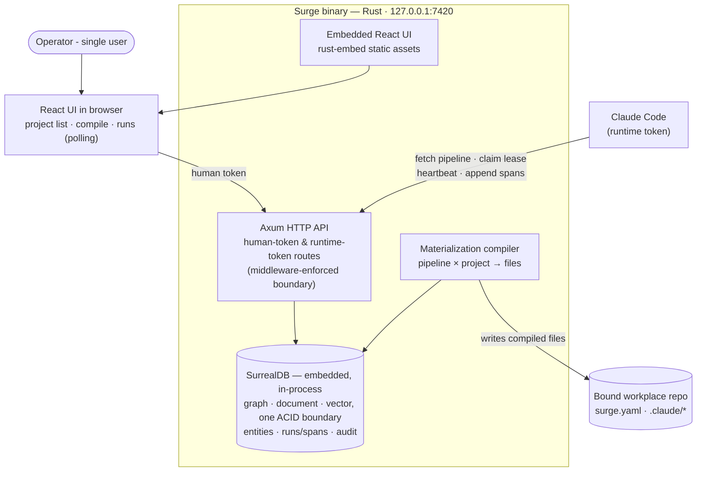

# Phase 0 — The materialization loop

**Status:** not_started
**Commitment level:** Phase 0 — ships to its real user (the operator) immediately; nothing here is throwaway.
**Time horizon:** ~3 weeks

## Purpose

Prove the product's central bet with the thinnest real slice: a pipeline stored in Surge compiles to a hashed materialization, the compiled files land in a bound repo, a real IDE runtime (Claude Code) fetches its pipeline over the runtime token, executes, and appends spans that show up in Surge. If this loop doesn't work — technically or ergonomically — the canvas, boards and observatory are decoration. **Riskiest assumption tested:** a compiled materialization can drive a real runtime session end-to-end, and the runtime can report spans back.

No visual editor in this phase: pipelines are defined as data (checked-in JSON/Rust fixtures). The editor is Phase 1.

## In scope

1. Cargo workspace scaffold (`crates/domain`, `crates/store`, `crates/server`, `ui/`) with `ts-rs` generation wired, and the embedded SurrealDB build budget measured and recorded (ADR-2).
2. The twelve-entity object model in `crates/domain`, persisted in embedded SurrealDB (`kv-rocksdb`) via `SCHEMAFULL` definitions applied at startup (ADR-5), with pipeline nodes/edges, doc chains and span trees stored as edge records rather than join tables — fixtures for entities not yet exercised.
3. Token middleware: human session token + per-project runtime token; runtime token limited to fetch pipeline · claim lease · heartbeat · append spans (INV-AUTH-1); loud refusal + audit entry on violation (INV-AUTH-2, INV-ERR-1).
4. Project binding: register a repo path, write `surge.yaml` (INV-DATA-1).
5. Materialization compiler: pipeline (data-defined) × project → `.claude/` files + `surge.yaml` step blocks, content-hashed; stale detection refuses dispatch (INV-ID-1).
6. Runtime API + a Claude Code integration recipe (hooks/settings the compiled output installs) proving fetch → run → spans-back against one real repo.
7. Minimal embedded UI: project list, compile button, runs list with span tree (read-only, polling — no SSE yet).

## Out of scope

- Pipeline editor canvas, all four canvas modes, blocks, undo/redo → Phase 1
- Library surfaces, versioning UI, trust/import review → Phase 1 (trust *enforcement* data model lands here, dormant)
- Board·Plan mirror and tracker connections → Phase 2
- Board·Ops: work orders, gates, Gate-2 review, taskgraph → Phase 2
- Dispatch queue, wave integration, budgets, aborts, lease TTL reclaim UX → Phase 2 (lease claim/heartbeat endpoints exist, minimal)
- SSE streaming, toasts → Phase 2
- Observatory beyond the minimal runs list: waterfall, COE, ratchet, metrics, replay, debugger → Phase 3
- Retention/compaction → Phase 3
- Settings surfaces, backup/restore, token rotation UI → Phase 3 (tokens themselves exist, managed by CLI/config)

## Done when

- `cargo build` yields one binary; opening `127.0.0.1:7420` shows the project list from the embedded UI.
- Binding a real repo writes `surge.yaml` and nothing else; compiling writes only the closed-list files (INV-DATA-1), and the materialization row shows its hash.
- Editing the pipeline fixture and re-compiling produces a new hash; dispatching against the old one is refused with a visible refusal run (INV-ERR-1).
- A real Claude Code session in the bound repo fetches its pipeline with the runtime token, runs a two-node pipeline (one doc node, one agent node), and its spans appear in the runs list with role, timing and status.
- A runtime-token call to a human endpoint (e.g. compile) is rejected and the audit table records it.
- Generated TypeScript types in `ui/` come from `crates/domain` with no hand-written duplicates.
- Every query in `crates/store` has a `kv-mem` integration test, and cold-build time plus stripped binary size are recorded against the ADR-2 budget.

## Architecture (this phase)

Strict subset of [`docs/product/architecture.md`](../../product/architecture.md): no dispatcher, no tracker mirror, no SSE — UI polls.

## Anticipated specs

| Feature | Hint |
|---|---|
| workspace-scaffold | cargo workspace, ui/ Vite app, ts-rs build wiring, rust-embed |
| domain-model | twelve entities as Rust structs, edge-record relationships, `ts-rs` derives |
| store-layer | embedded SurrealDB init, `SCHEMAFULL` definitions + startup apply, typed repository functions, `kv-mem` test harness |
| token-boundary | middleware, two token kinds, refusal + audit write path |
| project-binding | register repo, surge.yaml write, closed-list write guard |
| compiler-core | data-defined pipeline → hashed materialization → file writes, stale detection |
| runtime-api | fetch/lease/heartbeat/append-spans endpoints + Claude Code integration recipe |
| minimal-shell-ui | project list, compile action, runs/span tree, polling |

## Scoping assumptions

- scoping assumption — verify at spec time: Claude Code can be configured (via compiled `.claude/settings.json` hooks) to call a local HTTP endpoint at session start and per tool-use, sufficient to implement fetch-at-start and span reporting without forking the runtime.
- scoping assumption — verify at spec time: `ts-rs` covers all twelve entity shapes (incl. tagged enums for node kinds) without hand-written TS patches, and that its derives coexist with the SDK's `SurrealValue` derive — `RecordId` in particular needs a deliberate TypeScript representation rather than a default one.
- scoping assumption — verify **in the first task, not at spec time**: embedded SurrealDB's cold-build time and contribution to stripped binary size stay inside budget with default features off and only `kv-rocksdb`/`kv-mem` enabled. A blown budget reopens ADR-2 rather than being absorbed.
- scoping assumption — verify at spec time: `LIVE SELECT` on the local engine delivers reliable, ordered notifications suitable for the Phase 2 SSE bridge. Phase 0 polls, but ADR-3 now depends on this, so it is proven here rather than discovered in Phase 2.
- scoping assumption — verify at spec time: a typed repository layer plus `kv-mem` tests genuinely substitutes for the compile-time checking ADR-2 gave up — assessed against the lease, gate, trust and hash paths specifically.
- Greenfield: no claims about existing code exist; all `file:line` anchors will be minted at Layer 4.
