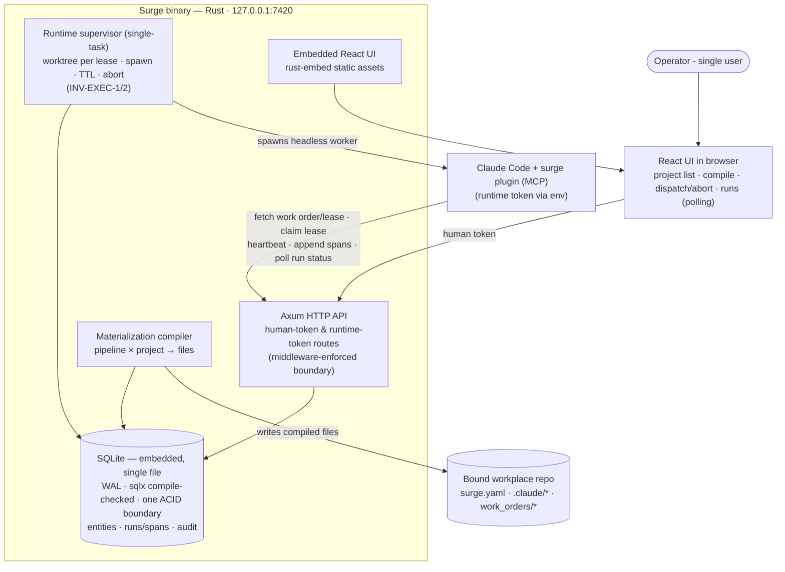

# Phase 0 — The materialization loop

**Status:** **accepted** 2026-08-28 — smoke walk 7 returned **GO** (`smoke-7-2026-08-28.md`, SHA `285b54f`), the first GO across seven walks. Accepted with the exceptions listed below; read them before treating phase 0 as finished.

**What the acceptance rests on.** Walk 7 was a *scoped* re-walk — walk 6's three findings plus a headline-loop regression check — not a full cold walk of this checklist. The Done-when lines are covered by walks 5, 6 and 7 between them, each on a different SHA. Nine real `claude -p` runs, every success verified against both the DB row and the git object behind it, zero 5xx, clean drain.

**Accepted with these exceptions:**

- **No UI was rendered on the accepting walk.** Walk 7's verdict rests on API, DB rows and git state only. The S8 cost-column change (`cost n/m`) has still never been looked at in a browser — walk 6 graded it *provisional* on the served bundle, and walk 7 did not upgrade that. No responsive surface has been walked on a device at any point.
- **Two commits landed after the walked SHA**: `459ebad` (the walk record) and `f8b1597` (W1's fix — one sentence in the work-order template). W1's fix changes the bytes every worker reads and was verified by the suite, **not** by a walk.
- **Known-open, triaged non-blocking**: N5 (reap destroys uncommitted work), N12 (`instance_meta` unwritten), B1 (no URL routing), B2 ("not assigned" after compile), F4–F6. `doc`/`coe`/`plan_issue` are schema-only by design (in-scope item 2).
- **Documented limitations of the commit floor**: a legitimately commit-free work order would false-fail (carve-out filed to phase 2, on the pipeline node's declared kind), and the floor is forgeable with `git commit --allow-empty` — judging work product is Gate-2 review's job, not the supervisor's.
**Commitment level:** Phase 0 — ships to its real user (the operator) immediately; nothing here is throwaway.
**Time horizon:** ~3 weeks

## Purpose

Prove the product's central bet with the thinnest real slice: a pipeline stored in Surge compiles to a hashed materialization, the compiled files land in a bound repo, a real IDE runtime (Claude Code) executes under it and appends spans that show up in Surge — **and** Surge itself can dispatch one headless worker, hold its lease, and abort it. If this loop doesn't work — technically or ergonomically — the canvas, boards and observatory are decoration. **Riskiest assumptions tested** (revised 2026-08-12): (1) Surge's runtime supervisor can spawn a headless `claude -p` worker for a dispatched issue and get spans back (INV-EXEC-1 — the actuator, without which all of §06 is fiction); (2) the compiled materialization drives a real session, with the runtime-token API (five capabilities, INV-AUTH-1) carrying work order, lease, heartbeats, spans and the abort-status poll. Compiling config files that Claude Code reads is near-certain to work; spawning and supervising is not — so it is proven first, even ugly.

No visual editor in this phase: pipelines are defined as data (checked-in JSON/Rust fixtures). The editor is Phase 1.

## In scope

1. Cargo workspace scaffold (`crates/domain`, `crates/store`, `crates/server`, `ui/`) with `ts-rs` generation wired and the `sqlx` offline-metadata workflow (`cargo sqlx prepare`) established (ADR-2).
2. The twelve-entity object model in `crates/domain`, persisted in embedded SQLite via `sqlx` migrations applied at startup (ADR-9), with pipeline nodes/edges, doc chains and span trees as edge tables traversed by recursive CTEs — fixtures for entities not yet exercised.
3. Token middleware: human session token + per-project runtime token; runtime token limited to the five capabilities — fetch work order/lease · claim lease · heartbeat · append spans · poll own-run status (INV-AUTH-1); loud refusal + audit entry on violation (INV-AUTH-2, INV-ERR-1).
4. Project binding: register a repo path, write `surge.yaml` (INV-DATA-1).
5. Materialization compiler: pipeline (data-defined) × project → `.claude/` files + `surge.yaml` step blocks, content-hashed per INV-ID-2 (semantic content only); stale detection refuses dispatch (INV-ID-1).
6. Runtime API + the **Claude Code plugin skeleton** (`integrations/claude-plugin/`, design §23-Eighteen / ADR-8): an MCP server exposing work-order fetch, span-append, heartbeat and status-poll tools (four of INV-AUTH-1's five capabilities; claim-lease is the interactive-session path and lands in Phase 2), registered by the compiled `.claude/settings.json`; hook-script HTTP glue as documented fallback. Proves run → spans-back against one real repo. The compiled `.claude/` files on disk are the pipeline; the fetch endpoint carries work order, lease and materialization hash (design §23-Seven).
7. **Minimal runtime supervisor** (INV-EXEC-1/2, single-task — no queue, waves or budgets): dispatch one issue → create a git worktree on the task branch, compile the materialization into it (gitignored per INV-DATA-7) → spawn one headless `claude -p` worker inside it with the runtime token injected as an env var (INV-AUTH-4) → lease with TTL + heartbeat → reclaim on silence → abort lands at the next tool call via the status poll → reap the worktree. Both run kinds (doc run, work-order run — design §23-Fourteen) exist on the Run entity; Phase 0 exercises one of each.
8. **Thin `surge` CLI**: `auth` (one-time session-claim URL flow, INV-AUTH-5), `status`, `compile`, `dispatch`, `abort` — the first-run path and the testable surface before the UI matures.
9. Minimal embedded UI **including the global shell** (design §07: sidebar, project switcher, toast/dialog layers — the frame every later surface mounts into): project list, compile button, dispatch/abort on one fixture issue, runs list with span tree (read-only, polling — no SSE yet).
10. **Default library seed** (design §03 — the shipped library is normative product content, not fixture data): the minimum items the Phase 0 two-node pipeline needs — one doc skill, one subagent, span emission via the plugin. The full seven-hook · six-subagent · seven-skill set is authored in Phase 1, where the library surfaces it ships in exist.

## Out of scope

- Pipeline editor canvas, blocks, undo/redo → Phase 1. Canvas modes split by data availability: dry run + diff overlay → Phase 1 · run overlay → Phase 2 (first real run data) · debugger → Phase 3
- Library surfaces, versioning UI, trust/import review → Phase 1 (trust *enforcement* data model lands here, dormant)
- Board·Plan mirror and tracker connections → Phase 2
- Board·Ops: work orders, gates, Gate-2 review, taskgraph → Phase 2
- Dispatch *queue* (priority/wave ordering, max-parallel), wave integration, budgets → Phase 2. Single-task dispatch, lease TTL/reclaim and abort land here (in-scope 7); Phase 2 adds the queueing policy around them, not the mechanism.
- Repo I/O beyond writes (doc ingest, work-order hash checks, wave git ops — INV-DATA-6) → Phase 2
- SSE streaming, toasts → Phase 2
- Observatory beyond the minimal runs list: waterfall, COE, ratchet, metrics, replay, debugger → Phase 3
- Retention/compaction → Phase 3
- Settings surfaces, backup/restore, token rotation UI → Phase 3 (tokens themselves exist, managed by CLI/config)

## Done when

- `cargo build` yields one binary; first launch prints the one-time claim URL, and only the browser that visits it holds a session (INV-AUTH-5) — opening `127.0.0.1:7420` cold shows the claim prompt, not the project list.
- Binding a real repo writes `surge.yaml` and nothing else; compiling writes only the closed-list files (INV-DATA-1), and the materialization row shows its hash.
- A stale or absent materialization refuses dispatch with a visible refusal run whose span carries the reason (INV-ERR-1, INV-ID-1). *(2026-08-25 smoke F5: reworded — "edit the fixture → new hash" had no walkable surface; hash-changes-on-semantic-edit is proven by the compiler test suite, and an edit surface arrives with Phase 1's editor.)*
- Dispatching one fixture issue creates a worktree on the task branch and spawns a headless `claude -p` worker inside it; the worker's MCP tools append spans (`surge_append_span`) and heartbeat (`surge_heartbeat`), and `surge_fetch_work_order` is **available and exercisable** to it (registered in the worktree's `.claude/mcp.json`, scoped to `$SURGE_ISSUE_ID`); both node kinds are exercised (a doc node via a doc run, an agent node via a work-order run) and their spans appear with role and status; the worktree is reaped at lease end (INV-EXEC-2). *(2026-08-25 smoke walk 4, S5: reworded — the original claimed a **two-node pipeline** executing as one sequenced run with per-span **timing** and node attribution. Phase 0 ships no node-sequencing engine and carries no node ids into the work order, so `node_id` and `duration_ms` are unattributed on worker spans. Node projection into the work order, `node_id` validation on span append, and worker-reported durations are Phase 1 work, tracked as N3/S5 — the line now states what phase 0 actually proves.)* *(2026-08-26 smoke walk 5, F2: the work-order clause had asserted an unbuilt tool on three consecutive walks — the plugin exposed only span/heartbeat/poll. Rather than amend the line a third time, the tool was built: `surge_fetch_work_order` now wraps the existing `GET /runtime/issues/{id}/work-order` endpoint, scoped to `$SURGE_ISSUE_ID`, and `crates/server/tests/plugin_integration.rs` drives it over real stdio JSON-RPC. The clause is now backed by an exercisable surface.)* *(2026-08-28 smoke walk 6, R2: the fetch clause is reworded a fourth and final time, from what the worker **does** to what the worker **can do**. Walk 6 saw a real worker call `surge_fetch_work_order` for the first time (span `sp_db49f0082ef7`) — but only 1 of 3 workers called it, because `crates/server/src/supervisor.rs:389-394` inlines the entire rendered work order into the prompt and then merely *suggests* the tool; a model already holding the work order has no reason to fetch it, and the mandate that would force it lives in the `implementer` subagent definition, which the headless top-level worker never reads. Making the loop genuinely depend on the fetch — prompt carries a pointer plus the lease/materialization hash, not the rendered body — is the INV-ID-1-shaped fix and is Phase 2 work alongside the claim-lease path. The span and heartbeat clauses, by contrast, are now proven by real worker spans.)*
- The compiled `.claude/` and `work_orders/` files are gitignored via the surge-managed block; `surge.yaml` and the doc node's output are committable (INV-DATA-7).
- Killing the worker mid-run reclaims the lease at TTL; pressing Abort lands at the worker's next tool call via the status poll, and both leave visible records (INV-ERR-1).
- A runtime-token call to a human endpoint (e.g. compile) is rejected and the audit table records it.
- Generated TypeScript types in `ui/` come from `crates/domain` with no hand-written duplicates.
- Every query in `crates/store` is `sqlx` compile-checked and covered by an in-memory (`sqlite::memory:`) test, directly or via the server integration suites. *(2026-08-25 smoke F6: the commit-broadcast clause moved out — the ADR-3 broadcast ships with Phase 2's SSE bridge, and its per-repo-function assertions land there.)*

## Architecture (this phase)

Strict subset of [`docs/product/architecture.md`](../../product/architecture.md): supervisor in single-task form, no dispatch queue, no repo I/O reads, no tracker mirror, no SSE — UI polls.

## Anticipated specs

| Feature | Hint |
|---|---|
| workspace-scaffold | cargo workspace, ui/ Vite app, ts-rs build wiring, rust-embed |
| domain-model | twelve entities as Rust structs, edge-record relationships, `ts-rs` derives |
| store-layer | SQLite pool init (WAL, foreign keys, busy_timeout), embedded `sqlx` migrations + startup apply, typed repository functions, commit-broadcast wiring, in-memory test harness |
| token-boundary | middleware, two token kinds, refusal + audit write path |
| project-binding | register repo, surge.yaml write, closed-list write guard |
| compiler-core | data-defined pipeline → hashed materialization → file writes, stale detection |
| runtime-api | five runtime-token endpoints (work order/lease fetch, claim, heartbeat, spans, status poll) |
| claude-plugin-mcp | plugin: MCP server (work-order fetch/span/heartbeat/status tools), settings.json registration, hook-glue fallback |
| supervisor-minimal | single-task worktree-per-lease spawn of headless claude -p, env token injection, lease TTL/reclaim, abort-at-next-tool-call, worktree reap |
| cli-thin | surge auth (claim URL), status, compile, dispatch, abort |
| minimal-shell-ui | global shell (sidebar · switcher · toast/dialog layers), project list, compile action, dispatch/abort, runs/span tree, polling |
| default-library-seed | minimum normative library items for the Phase 0 pipeline (one doc skill, one subagent) |

## Scoping assumptions

- scoping assumption — verify at spec time: a Claude Code plugin can bundle an MCP server whose tools cover fetch-at-start, span reporting, heartbeat and the abort-status poll, registered via compiled `.claude/settings.json`, without forking the runtime (ADR-8). Fallback if any tool is uncoverable: the hook-script HTTP glue for that piece.
- scoping assumption — verify at spec time: a headless `claude -p` process spawned by Surge in a fresh worktree inherits the worktree's compiled `.claude/` config (including plugin/MCP registration) and can run a multi-node pipeline non-interactively (permissions, tool allowlist, exit semantics).
- scoping assumption — verify at spec time: `ts-rs` covers all twelve entity shapes (incl. tagged enums for node kinds) without hand-written TS patches, and that its derives coexist with `sqlx::FromRow` on the same structs — id newtypes in particular need a deliberate TypeScript representation rather than a default one.
- scoping assumption — verify at spec time: the recursive CTEs for the deepest traversals Phase 0 touches (span tree, pipeline DAG) stay readable behind their repository functions and compile-check cleanly under `sqlx` — assessed against the lease, gate, trust and hash paths specifically. *(2026-08-25: replaces three SurrealDB-era assumptions — build budget, `LIVE SELECT` reliability, and the tests-for-compiler substitution — all mooted by the ADR-2 reversal; commit-then-broadcast ordering is asserted directly by the store-layer tests.)*
- Greenfield: no claims about existing code exist; all `file:line` anchors will be minted at Layer 4.
