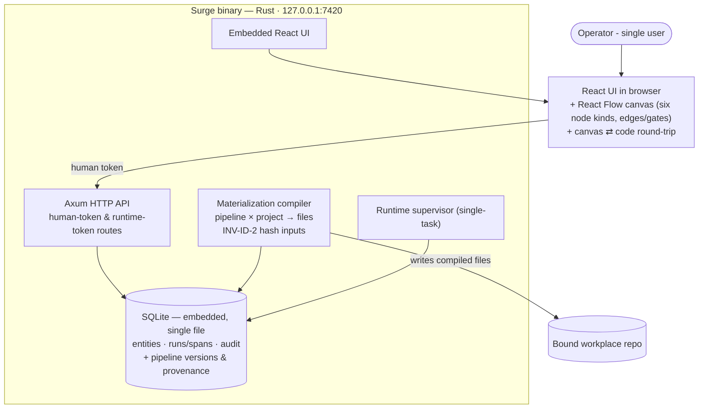

# Phase 1.1 — The faithful canvas

**Status:** not_started
**Parent:** [phase-1](../phase-1/phase.md) · **Epic 1 of 3, runs first**
**Commitment level:** Phase 1 — ships to the operator.
**Time horizon:** ~2 weeks — the least defensible estimate in the plan (carried from the parent, 2026-08-12). If it slips, cut from 1.3 first; nothing in this epic is cuttable without losing the thesis.

## Purpose

Prove the architectural thesis of phase 1: **what you draw is exactly what materializes.** A pipeline authored on the canvas and the same pipeline pasted as text must compile to the same hash, and presentation state must never touch that hash. Every later epic consumes an editable, versioned pipeline object; until the hash contract holds, nothing built on it can be trusted.

This is the load-bearing epic (diagnostic Q2) and runs first for the same reason Phase 0 proved the actuator before the canvas: the risky claim goes first, even ugly.

## In scope

1. **Pipeline editor core**: React Flow canvas, all six node kinds **rendered and round-tripped**, edges with triggers and required-gate locks, multi-select, undo/redo (design §11).
   *Clarified 2026-08-28 during spec grounding:* `NodeConfig::Block` is one of the six kinds in the domain (`crates/domain/src/pipeline.rs:76-81`) and its `members`/`exposed_params` are hashed (`crates/compiler/src/hash.rs:38`). A Block node must therefore render, load, save and hash correctly **here** — the round-trip contract is not satisfiable with a kind missing. What moves to 1.3 is the *authoring UX*: composing a block from a selection, collapse/expand affordances, exposing parameters, palette publish. In 1.1 a Block renders as one opaque node and survives edit/save unchanged.
2. **Pipeline read/write API**: `crates/server/src/human_api.rs` exposes **no** pipeline route today (verified 2026-08-28 — the router carries projects, issues, runs, audit and compile only), while `crates/store/src/pipelines.rs` already has `insert_graph`/`load_graph`. The canvas needs that seam; it is in this epic, not assumed.
3. **UI scaffolding**: `ui/package.json` has exactly two dependencies today, `react` and `react-dom`. React Flow (`@xyflow/react`), TanStack Router/Query and Tailwind are *decisions* in CLAUDE.md and marked **(P1)** in the code map — none is installed. That cost lands here.
4. **Two-way code sync**: canvas ⇄ textual pipeline representation (the Phase 0 data format becomes the paste/round-trip format). Hash inputs per INV-ID-2: semantic content only, presentation state never hashed.
5. **Pipeline versioning**: fork with provenance, version history, blessed flag (INV-DATA-3); project-local edits create a local revision hash immediately, promote-to-fork adopts it (INV-ID-3, design §23-Nine). The history *surface* (list, diff view) is 1.3; the identity machinery is here.

## Out of scope

- Block **authoring UX** — composing from a selection, collapse/expand, exposed parameters, palette publish → 1.3 (deliberately: the parent's named first cut must not sit in the epic that proves the thesis). Block *rendering and round-trip* stay here; see in-scope 1
- Library, trust, compile dialog, upgrade review → 1.2
- Pipelines page, project overview, canvas modes, EVAL tab → 1.3
- Everything in the parent's whole-phase Out of scope

## Done when

- A pipeline exported to text and pasted back **round-trips to the same hash** (INV-ID-2). *(Amended 2026-08-28: the line previously said "drawn from scratch … same hash as its pasted textual form", which is false as stated — node and edge `id` are hash inputs (`crates/compiler/src/hash.rs:61-74`), so a graph redrawn by hand mints different ids and hashes differently, however identical it looks. Fidelity is a property of the round-trip carrying ids across, not of two independent authoring routes converging. Making it converge would mean canonicalizing ids out of the hash — `role:critical`, and not this epic's job.)*
- Moving a node or renaming its label changes **no** hash — proved on the payload the **canvas produces after a UI mutation**, not on the compiler's own fixtures. *(Amended 2026-08-28, spec review: frames and stickies dropped from this line — they have no domain type, no table and no owning spec, and belong with the annotate palette in 1.3. The compiler-level version of this assertion is already green at `crates/compiler/tests/compile.rs:48`, so a canvas AC that stops there proves nothing about the canvas.)*
- Editing a project canvas immediately shows `vN + local rev <hash>` on the assignment line; promote-to-fork names that revision as the fork's provenance (INV-ID-3). *(Decided 2026-08-28: the canvas **commits on mutation** — there is no browser-side unsaved buffer. A buffered model would leave a project reading plain `vN` while local edits existed, which INV-ID-3 forbids in as many words.)*
- Forking a blessed template, editing the fork and compiling leaves the template's hash and history untouched.
- Round-tripping canvas → text → canvas → text produces byte-identical text on the second pass for every one of the six node kinds.

*Each line above names an exercisable surface. That is deliberate: three of seven phase-0 walks found a Done-when line asserting something the tree did not do (`smoke-patterns.md`, walk-5 F2 / walk-6 R2 / walk-7 W1).*

## Architecture (this epic)

Strict subset of the parent. Same containers as Phase 0; the browser grows the canvas and the round-trip seam only. No library surfaces, no dialogs.

## Anticipated specs

| Feature | Hint |
|---|---|
| pipeline-assignment | assignment data path (store + endpoint), and making `pipeline.content_hash` mean what it says — **spec'd first** |
| pipeline-revisions | the project-local revision entity, its lifecycle, materialization staleness, run recording |
| promote-to-fork | fork semantics, provenance, blessed preservation, id-preserving hash equality |
| canvas-editor | React Flow, six node kinds (Block opaque), palette creation, edges/gates, selection, undo/redo, the pipeline HTTP seam, UI scaffolding |
| code-roundtrip | canvas ⇄ text format, hash-fidelity contract, byte-identical second pass, id minting, lossy `EdgeTrigger::parse` |

**`pipeline-versioning` split into three, 2026-08-28.** Drafted as one spec, it drew 28 blockers across two fresh reviews. The cause was breadth, not prose: it carried assignment, the revision entity, forking, staleness integration, compile targeting, run recording and a hash backfill, compressed to exactly the 8-AC cap — which was gaming the cap, not respecting it. Each round the design collided with substrate the spec was too broad to have grounded: `materialization.pipeline_id` has no `ON DELETE` action, so deleting a compiled revision is FK-blocked; the compiled `surge.yaml` carries the pipeline **name** into a committed file (`crates/compiler/src/emit.rs:161`), so a synthetic revision name would land in the operator's git history. Five specs in this epic, not three.

**Spec order inverted 2026-08-28.** The list was authored canvas-first. Grounding the canvas spec established that commit-on-mutation is what INV-ID-3 requires, which makes the project-local revision entity a *prerequisite* of the canvas rather than a consequence of it. `pipeline-versioning` is spec'd first.

## Known defects this epic must own

| Defect | Evidence | Owner |
|---|---|---|
| **`EdgeTrigger` round-trips lossily, and it changes the hash.** `EdgeTrigger::Custom("passed")` serializes to JSON as `{"custom":"passed"}` but persists via `as_str()` as the bare string `"passed"` (`crates/store/src/pipelines.rs:57`) and reloads through `parse()` as the unit variant `Passed` (`crates/domain/src/pipeline.rs:154-166`). Those two produce different `SemanticEdge` JSON and therefore different `pipeline_content_hash` values — so a pipeline with a custom trigger colliding with a reserved word changes identity across save/reload | found during canvas-editor spec review, 2026-08-28 | `code-roundtrip` |

Latent in phase 0 because pipelines are seeded, never authored. The canvas is what exposes it.

| **A pre-existing `surge.db` keeps the old placeholder `content_hash`.** ESC-1 (`3ecd585`) makes the seed derive the hash before insert, but its `exists()` guard skips databases that already hold the row, and correcting it in place would need an update on a published pipeline version (INV-DATA-3). **Remedy: delete the local dev DB.** Inert today — nothing in production reads the column; `crates/server/src/compile_api.rs:43` loads the graph and `crates/compiler/src/lib.rs:119` recomputes the hash from it. It stops being inert the moment a phase-1.1 feature reads the column | ESC-1 review, 2026-08-28 | `pipeline-assignment` |
| **`insert_graph` accepts whatever hash it is handed**, so the ESC-1 fix is one caller away from regressing. Today the seed is the only production caller (verified by grep across `crates/`, `ui/`, `integrations/`) | ESC-1 review, 2026-08-28 | `pipeline-assignment` |

| **The two claim-lease refusals disagree about their audit subject.** `claim_lease`'s pre-existing `Ok(false)` branch records `subject = issue_id`; every other refusal records `subject = reason` (3 of 4). More sharply: `audit_entry` has **no `issue_id` and no `run_id` column** (`crates/store/migrations/0002_object_model.sql:200-207`), so `subject` is the only slot that can name the thing acted on — the new refusal row cannot identify *which issue* was refused from the audit trail alone, only by project + timestamp. Unify to `"{issue_id} — {reason}"`, the shape `runtime_api::refuse` already uses | ESC-2 review, 2026-08-28 | unassigned |
| **`refusal_run` seeds its run id on `{issue_id}{now}` at millisecond resolution.** Two claims for one issue in the same millisecond collide on the primary key, and the refusal answers 500 with nothing recorded — an INV-ERR-1 hole inside the fix for INV-ERR-1 holes. Pre-existing formula, but the claim path is the first place it is reachable by a retry loop against a pollable endpoint | ESC-2 review, 2026-08-28 | unassigned |
| **`dispatch_doc_run`'s unknown-project branch is still a recordless 500** (`crates/server/src/supervisor.rs`), while `dispatch_issue`'s analogue writes an audit row. The fourth refusal-shaped path; deliberately out of ESC-2's scope | ESC-2 review, 2026-08-28 | unassigned |

| **`insert_fresh` lets a caller falsify the `NotCompiled` premise.** `crates/store/src/materializations.rs` writes `fresh` from the caller's struct. A caller passing `fresh: false` would stale the predecessors and insert a non-fresh successor — producing the `EXISTS(any) AND NOT EXISTS(fresh)` state that `NotCompiled`'s correctness depends on being unreachable, and the pill would then say "not compiled" about a project that *has* compiled. No caller does this today (the sole production caller sets `fresh: true`), so the premise is enforced by convention, not by the type system. `ensure!(m.fresh, …)` makes it structural | ESC-3 review, 2026-08-28 | `pipeline-revisions` — the task that makes the distinction load-bearing |
| **The project card's badge slot hides `unbound repo` behind `not compiled`.** `ui/src/registry.tsx` keeps a mutually-exclusive ternary whose first branch used to be unreachable and is now the common case, so a project that is both unbound *and* uncompiled shows "not compiled" while its actual next action is **bind**. Rare today because the UI create flow binds immediately, but it is a real user-visible change no test pins | ESC-3 review, 2026-08-28 | `project-overview` (1.3) or a direct fix |
| **`materialization.project_id` is not indexed.** SQLite creates no index for a foreign-key child column; the only index in the schema is `span_by_run`. The derived-status subquery is therefore a correlated full scan of `materialization` per project row. Irrelevant at single-user local scale, but the reason is worth stating correctly — add `CREATE INDEX materialization_by_project ON materialization(project_id)` whenever the next migration touches that table | ESC-3 review, 2026-08-28 | next migration author |
| **`POST /api/projects` commits the project insert and its audit row as two separate pool calls**, unlike the transactional pattern the bind path uses — an INV-DATA-8 gap on the create path. Pre-existing, unrelated to ESC-3 | ESC-3 review, 2026-08-28 | unassigned |

### Decide before `pipeline-assignment`: where `pipeline_content_hash` lives

The ESC-1 reviewer proposed a third option that neither the implementer nor I had considered, and it is better than both: **move `pipeline_content_hash` from `surge-compiler` into `surge-domain`.** `crates/compiler/src/hash.rs` imports nothing but `surge_domain::pipeline` types plus `serde`/`sha2`/`hex`, so relocating it adds **no crate edge in either direction** — and it dissolves the residual gap entirely: the fixture could compute its own identity, and `insert_graph` could derive the hash rather than accept one.

The alternative that looks obvious — having `insert_graph` call the compiler — is the *wrong* structural fix: it puts `surge-store → surge-compiler` in the shipped graph, and the honest home for hash derivation is the publish path, not a repository function.

Relocation is `role:critical` (code map, compiler row: hash-input changes are serialized), so it is not a drive-by. Decide it before `pipeline-assignment` adds the second writer.

## Scoping assumptions

- verify at spec time: the Phase 0 pipeline data format is expressive enough to be the round-trip format. Canvas-only state (positions, frames, stickies) is excluded from the hash by INV-ID-2, so lossiness there cannot break fidelity — but it *can* break the byte-identical second pass, which is why that is a separate Done-when line.
