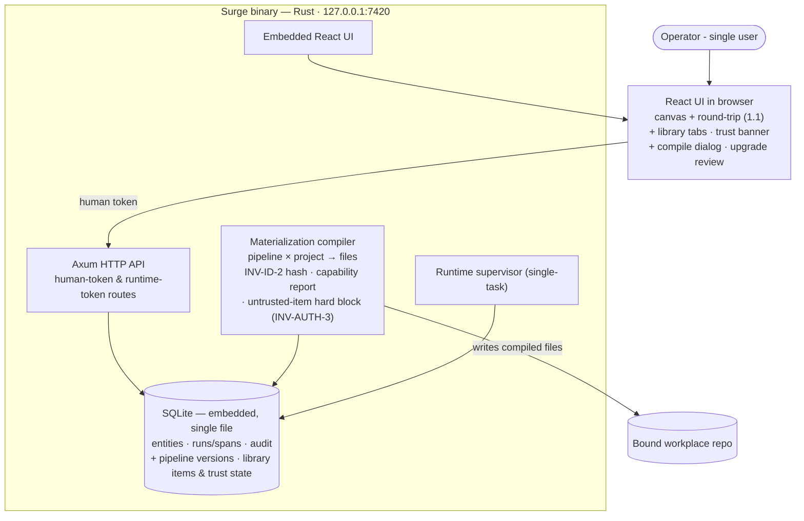

# Phase 1.2 — Library, trust and compile governance

**Status:** not_started
**Parent:** [phase-1](../phase-1/phase.md) · **Epic 2 of 3** · depends on 1.1
**Commitment level:** Phase 1 — ships to the operator.
**Time horizon:** ~1.5 weeks

## Purpose

Make the library real and the compile boundary honest: **nothing compiles that has not been reviewed, and the capability report tells the truth about what the graph will be allowed to do.** Trust is an enforcement boundary (INV-AUTH-3), not a presentation concern — which is why it is separated from the pages in 1.3.

## In scope

1. **Library**: Hooks · Subagents · Skills tabs, immutable-per-version publish flow, drafts (INV-DATA-2).
2. **Trust flow**: imports land untrusted, red banner, Mark reviewed, compile hard-block naming untrusted items (INV-AUTH-3). Every step audit-logged.
3. **Compile dialog** with the four-line capability report (writes · shell · network · egress) and signature line (design §04).
4. **Upgrade review dialog** for bumping pinned library versions (design §23-Two). It *launches from* 1.3's composition table, but the dialog and its affected-node computation are here, because the versioning semantics belong with the library.
5. **Default library, full set**: the normative seven hooks · six subagents · seven skills backing the doc chain (design §03/§10), authored and published through the library surfaces this epic builds — on the Phase 0 seed.

## Out of scope

- Pipelines page, project overview, canvas modes, blocks → 1.3
- Egress allowlist *editor* → Phase 3 (the egress *data* exists here for the capability report)
- Everything in the parent's whole-phase Out of scope

## Done when

- Importing a skill marks it untrusted; compile of a referencing pipeline is refused **naming the untrusted item**; Mark reviewed unblocks; every step writes an audit row.
- Bumping a pinned library version runs the upgrade review dialog (diff + affected nodes) and produces a new pipeline version.
- The capability report lines match the graph: adding a stage node changes the shell line; granting WebSearch changes the network line.
- Publishing an item at vN+1 leaves vN byte-identical and still resolvable by anything pinned to it (INV-DATA-2).
- The full 7·6·7 default set is published through these surfaces — not seeded past them — and a pipeline referencing every item compiles.

*Each line names an exercisable surface, per the phase-0 pattern rows.*

## Architecture (this epic)

Superset of 1.1: the browser grows library tabs, the trust banner and two dialogs; the compiler grows the capability-report computation. Still no pages, no canvas modes.

## Anticipated specs

| Feature | Hint |
|---|---|
| library-store | items, drafts, publish vN+1, pinning, immutability |
| trust-and-import | untrusted state, review flow, compile hard-block naming the item |
| compile-dialog | capability report computation + signature line |
| upgrade-review | pinned-version bump dialog, affected-node list |
| default-library | the normative 7·6·7 item set backing the doc chain, authored on the Phase 0 seed |

## Scoping assumptions

- verify at spec time: the Phase 0 capability-report computation (`crates/compiler/src/capability.rs`) can be extended to the four-line form without the per-line `enforced`/`declared` egress tiering, which the code map marks P2. If it cannot, the egress line ships *declared-only* and says so on its face — it must not imply enforcement that does not exist (INV-DEPLOY-1's 2026-08-26 correction is the precedent).
