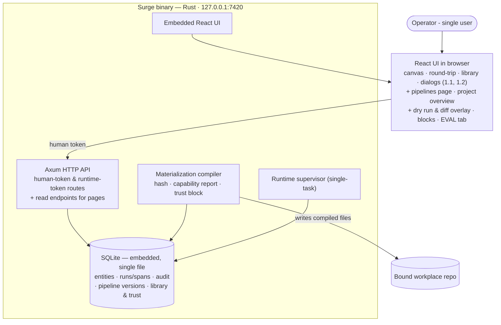

# Phase 1.3 — Authoring surfaces

**Status:** not_started
**Parent:** [phase-1](../phase-1/phase.md) · **Epic 3 of 3** · depends on 1.1 and 1.2
**Commitment level:** Phase 1 — ships to the operator.
**Time horizon:** ~1.5 weeks — **this is the cut buffer.** If phase 1 slips, cut from here, in this order: blocks-and-groups, then the EVAL tab, then the builder diff overlay.

## Purpose

Give the operator somewhere to see, navigate and reason about what they authored: the pipelines list and detail, the project overview, and the two canvas modes that need no run data. This epic is presentation over 1.1's and 1.2's guarantees — it carries no line of the parent's `Done when`, which is why it is last and why it is the safe place to cut.

## In scope

1. **Pipelines page** (design §09): filter rail, card grid, and the detail view — composition tables, version history with diff, materializations list, broken-reference states. Includes the assign-pipeline dialog and reassignment semantics ("fetched at the next session start", design §18). The upgrade-review dialog (1.2) launches from this page's composition table.
2. **Project·Overview** (design §12): binding/subagents/hooks cards, assignment card with the stale box, docs chips (data-only until the Phase 3 Docs surface), recent runs.
3. **Canvas modes, first two**: dry run (topological walk, cost estimate, gate callouts) and the builder diff overlay (design §11). Run overlay → Phase 2; debugger → Phase 3.
4. **Blocks and groups**: composite nodes, palette publish, exposed parameters (design §11). Moved here from the editor epic — see the parent's "deliberate departure" note.
5. **Inspector EVAL tab** in its disclaimed deterministic form, plus the context-budget bars (design §11); real evals and calibration stay post-V3.

## Out of scope

- Run overlay canvas mode → Phase 2 (needs real run data); debugger → Phase 3
- Real evals and calibration → post-V3
- Docs surface behind the overview's docs chips → Phase 3
- Everything in the parent's whole-phase Out of scope

## Done when

- The pipelines list filters and opens a detail view whose composition table names every pinned library item at its pinned version, with a broken-reference state rendered when a pin cannot resolve.
- Version history renders a diff between any two versions of the same pipeline lineage, using 1.1's provenance.
- Assigning a pipeline to a project from this page shows the assignment on Project·Overview, and the overview's stale box appears when the assigned version has moved.
- A dry run walks the graph topologically and reports its cost estimate and gate callouts **without dispatching anything** — no run row is written.
- The builder diff overlay shows what changed between the canvas as drawn and the last compiled materialization.
- A block with exposed parameters round-trips through 1.1's code sync without changing the pipeline hash (INV-ID-2 — a block is a presentation grouping over the same semantic graph).
- The EVAL tab renders its disclaimer on its face; nothing in it implies a measured result. *(Precedent: phase-0 S8, where a cost column rendered `$0.000` for an unmetered value and had to be changed to say `cost n/m`.)*

## Architecture (this epic)

Superset of 1.2 — the full phase-1 architecture. The browser grows the two pages and the canvas modes; no new container, no new server capability beyond read endpoints for the pages.

## Anticipated specs

| Feature | Hint |
|---|---|
| pipelines-pages | §09 list + detail (composition, history/diff, materializations, broken refs), assign dialog |
| project-overview | §12 two-column health page, cross-surface jumps, stale box |
| canvas-modes | dry run walk + builder diff overlay; EVAL tab disclaimed panel + context-budget bars |
| blocks-and-groups | composite nodes, palette publish, exposed parameters, hash-neutral |

## Scoping assumptions

- verify at spec time: React Flow's grouping/sub-flow support can express collapsible blocks with exposed parameters without a custom layout engine. If it cannot, this is the cut — it is why blocks sit in this epic.
- verify at spec time: a dry run can compute a cost estimate with no metering in place. Phase 0's `run.cost`/`span.cost` are hardcoded 0.0 and the INV-EXEC-3 meter is Phase 2 (walk-5 S8). If the estimate cannot be grounded, the panel says so on its face rather than rendering a plausible number.
