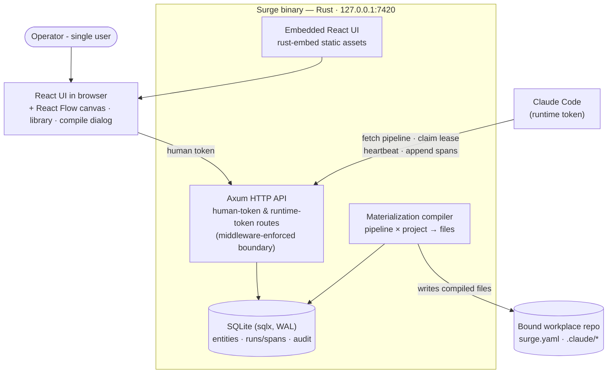

# Phase 1 — Author: canvas & library

**Status:** not_started
**Commitment level:** Phase 1 — ships to the operator.
**Time horizon:** ~4–5 weeks

## Purpose

Make pipelines and library items *authorable* instead of data-defined: the React Flow canvas with all six node kinds, versioning (fork-never-edit), and the trust-gated library. Tests the second-biggest assumption: that the graph editor can stay faithful to the compiled artifact — what you draw is exactly what materializes (same hash inputs).

## In scope

1. Pipeline editor: React Flow canvas, six node kinds, edges with triggers and required-gate locks, multi-select, grouping/blocks with exposed parameters, undo/redo (design §11).
2. Two-way code sync: canvas ⇄ textual pipeline representation (the Phase 0 data format becomes the paste/round-trip format).
3. Pipeline versioning: fork with provenance, version history with diff, blessed flag (INV-DATA-3).
4. Library: Hooks · Subagents · Skills tabs, immutable-per-version publish flow, drafts (INV-DATA-2).
5. Trust flow: imports land untrusted, red banner, Mark reviewed, compile hard-block naming untrusted items (INV-AUTH-3).
6. Compile dialog with the four-line capability report (writes · shell · network · egress) and signature line (design §04).
7. Upgrade review dialog for bumping pinned library versions (design §23-Two).

## Out of scope

- Board·Plan mirror, tracker connections → Phase 2
- Board·Ops, work orders, gates on issues, dispatch queue → Phase 2
- Wave integration, budgets, aborts → Phase 2
- SSE, heartbeat live-lines, toasts beyond basics → Phase 2
- Observatory waterfall, COE, ratchet, metrics, replay, node evals, debugger → Phase 3
- Retention/compaction → Phase 3
- Settings surfaces, backup/restore, token rotation UI, egress allowlist editor → Phase 3 (egress *data* exists for the capability report)
- Frames/stickies round-trip fidelity — explicitly deferred; known-lossy per design §23 "Designed but not wired"

## Done when

- A pipeline drawn from scratch on the canvas compiles to the same hash as its pasted textual form (canvas↔code fidelity).
- Forking a blessed template, editing the fork and compiling leaves the template's hash and history untouched.
- Importing a skill marks it untrusted; compile of a referencing pipeline is refused naming it; Mark reviewed unblocks; every step audit-logged.
- Bumping a pinned library version runs the upgrade review dialog (diff + affected nodes) and produces a new pipeline version.
- The capability report lines match the graph: adding a stage node changes the shell line; granting WebSearch changes the network line.

## Architecture (this phase)

Superset of Phase 0 (same containers; the UI grows the canvas/library surfaces). Still no dispatcher, mirror or SSE.

## Anticipated specs

| Feature | Hint |
|---|---|
| canvas-editor | React Flow, node kinds, edges/gates, selection, undo/redo |
| blocks-and-groups | composite nodes, palette publish, exposed parameters |
| code-roundtrip | canvas ⇄ text format, hash-fidelity contract |
| pipeline-versioning | fork, provenance, history, diff, blessed flag |
| library-store | items, drafts, publish vN+1, pinning |
| trust-and-import | untrusted state, review flow, compile hard-block |
| compile-dialog | capability report computation + signature |
| upgrade-review | pinned-version bump dialog, affected-node list |

## Scoping assumptions

- scoping assumption — verify at spec time: React Flow's grouping/sub-flow support can express collapsible blocks with exposed parameters without a custom layout engine.
- scoping assumption — verify at spec time: the Phase 0 pipeline data format is expressive enough to be the round-trip format (no canvas-only state beyond positions/frames).
