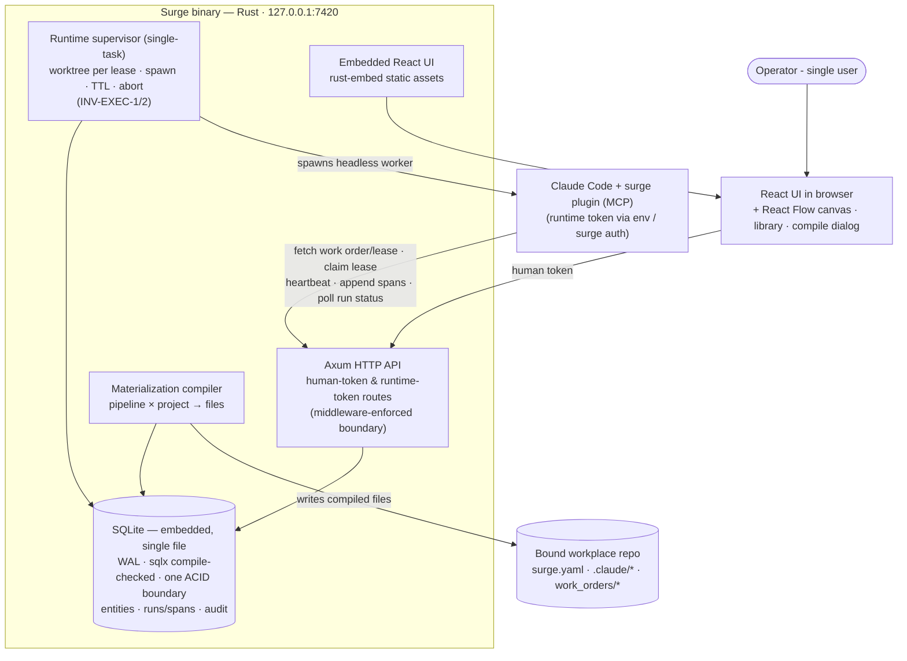

# Phase 1 — Author: canvas & library (overview)

**Status:** not_started — **split into three epics 2026-08-28** (`/halfcycle:phase-rescope`). This file is the overview; each epic below is a full execution unit with its own scope, `Done when`, taskgraph, orchestration state and COE.
**Commitment level:** Phase 1 — ships to the operator.
**Time horizon:** ~4–5 weeks total.

## Purpose

Make pipelines and library items *authorable* instead of data-defined: the React Flow canvas with all six node kinds, versioning (fork-never-edit), and the trust-gated library. Tests the second-biggest assumption: that the graph editor can stay faithful to the compiled artifact — what you draw is exactly what materializes (same hash inputs).

## The epics

Execution order is dependency order; the load-bearing epic is first.

| Epic | Name | Specs | Thesis |
|---|---|---|---|
| [phase-1.1](../phase-1.1/phase.md) | The faithful canvas | 3 | What you draw is exactly what materializes |
| [phase-1.2](../phase-1.2/phase.md) | Library, trust and compile governance | 5 | Nothing compiles that has not been reviewed, and the capability report tells the truth |
| [phase-1.3](../phase-1.3/phase.md) | Authoring surfaces | 4 | The operator can see, navigate and reason about what they authored |

## Why this split (the four-question diagnostic, 2026-08-28)

Three of four fired. Recorded because "twelve specs" alone would **not** have justified a split — task count is a batch, not an epic.

1. **Natural demo points separated by weeks of work? — YES.** "A pipeline drawn from scratch compiles to the same hash as its pasted textual form" is demonstrable with the canvas and round-trip alone: no library surfaces, no pipelines page, no overview. "Import an untrusted skill → compile refused naming it → mark reviewed → compiles, and the capability report matches the graph" is a second, independent demo weeks later.
2. **One part load-bearing and risky enough to prove first? — YES.** The phase's own Purpose names canvas↔code hash fidelity as the assumption under test, and the original time-horizon note flagged blocks-plus-round-trip as "the least defensible estimate in the plan". Everything else in the phase consumes an editable, versioned pipeline object; nothing else can be trusted until the hash contract holds. It becomes phase-1.1 and runs first.
3. **Independent dependency subgraphs? — PARTIAL, not counted as a yes.** Authoring mechanics and library governance are largely separable, but the seam is not clean: `upgrade-review` straddles the library and the pipelines page, and `pipeline-versioning` is consumed by both the canvas (local revision hash on edit) and the surfaces (history/diff). The split below cuts along the cleaner seam and accepts that 1.3 consumes both predecessors.
4. **Design thinking already converged? — YES.** The 2026-08-23 coverage audit recorded an expected split of "editor epic vs. surfaces epic". This split honours that seam and refines it: library/trust governance is separated from presentation surfaces, because trust is an enforcement boundary (INV-AUTH-3) and the pages are not.

**One deliberate departure from the recorded expectation.** `blocks-and-groups` moves *out* of the editor epic and into 1.3. The original phase doc says: "if it slips, cut blocks/grouping to a later phase before cutting round-trip fidelity." A thing named as the first candidate to cut must not sit inside the load-bearing epic, or cutting it means reopening the epic that proves the thesis. Putting it in the last epic makes the intended cut a no-op on 1.1 and 1.2.

## Overall `Done when` (the parent's bar; each epic carries its own slice)

- A pipeline drawn from scratch on the canvas compiles to the same hash as its pasted textual form (canvas↔code fidelity per INV-ID-2 — moving nodes or adding stickies changes no hash). *(1.1)*
- Editing a project canvas immediately shows `vN + local rev <hash>` on the assignment line; promote-to-fork names that revision as the fork's provenance (INV-ID-3). *(1.1)*
- Forking a blessed template, editing the fork and compiling leaves the template's hash and history untouched. *(1.1)*
- Importing a skill marks it untrusted; compile of a referencing pipeline is refused naming it; Mark reviewed unblocks; every step audit-logged. *(1.2)*
- Bumping a pinned library version runs the upgrade review dialog (diff + affected nodes) and produces a new pipeline version. *(1.2)*
- The capability report lines match the graph: adding a stage node changes the shell line; granting WebSearch changes the network line. *(1.2)*

Phase 1 is complete when all three epics are accepted. 1.3 carries no parent `Done when` line of its own — it is presentation over 1.1 and 1.2's guarantees — so its acceptance bar lives in its own doc.

## Out of scope (whole phase)

- Board·Plan mirror, tracker connections → Phase 2
- Board·Ops, work orders, gates on issues, dispatch queue → Phase 2
- Wave integration, budgets, aborts → Phase 2
- SSE, heartbeat live-lines, toasts beyond basics → Phase 2
- Observatory waterfall, COE, ratchet, metrics, replay, debugger → Phase 3 (the EVAL panel's disclaimed form ships in 1.3)
- Retention/compaction → Phase 3
- Settings surfaces, backup/restore, token rotation UI, egress allowlist editor → Phase 3 (egress *data* exists for the capability report)
- Frames/stickies round-trip fidelity — explicitly deferred; known-lossy per design §23 "Designed but not wired"

## Architecture (whole phase)

Superset of Phase 0 (same containers, supervisor still single-task; the UI grows the canvas/library surfaces). Still no dispatch queue, repo I/O reads, mirror or SSE. Each epic's doc carries the strict subset it ships.

## Scoping assumptions (whole phase)

- verify at spec time: React Flow's grouping/sub-flow support can express collapsible blocks with exposed parameters without a custom layout engine. *(1.3)*
- verify at spec time: the Phase 0 pipeline data format is expressive enough to be the round-trip format (canvas-only state — positions, frames, stickies — is excluded from the hash by INV-ID-2, so lossiness there cannot break fidelity). *(1.1)*
