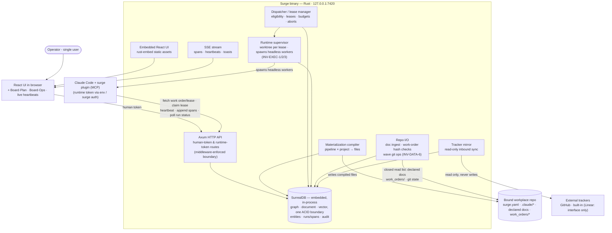

# Phase 2 — Execute: boards & lifecycle

**Status:** not_started
**Commitment level:** Phase 2 — ships to the operator.
**Time horizon:** ~4–5 weeks

## Purpose

Wire the execution half: the Plan/Ops board split, work orders, gates, and the full dispatch lifecycle from approved taskgraph to wave PR (design §06). Phase 0 proved the actuator (single-task spawn, lease, abort — INV-EXEC-1); this phase adds the *policy* around it: queueing, waves, budgets, retries. Tests the assumption that Surge can orchestrate many real runtimes with humans intervening at every named point.

## In scope

1. Board·Plan: read-only tracker mirror (GitHub + built-in tracker first; Linear behind an interface), Surge-own sprint/planning fields, divergence badge + "Needs you" queue (INV-DATA-5, design §23-Four).
2. Board·Ops: issues from an approved taskgraph, work orders with revisions clearing Gate-2 review, hash-mismatch refusal (design §05).
3. Gates: required-gate edges enforced at dispatch; unlock/relock as separate audited acts (design §23-Three).
4. Dispatch: eligibility rules, priority-then-wave queue, max-parallel spawning via the Phase 0 supervisor (INV-EXEC-1), stale-materialization refusal runs.
5. Leases: retry queueing on reclaim, layered on Phase 0's claim/TTL/heartbeat mechanism (design §06).
6. Implement→verify→retry loop with fanout and retry caps as graph edges; pass/fail and budget transitions derive from Surge-observed facts (exit codes, stage results, supervisor metering), never span content (INV-EXEC-3). Workers run isolated worktree-per-lease (INV-EXEC-2).
7. Wave integration issues: dependency-ordered rebase, contract checks, wave PR, conflict report — via the repo I/O component's git ops (INV-DATA-6), which also lands doc ingest and work-order hash checks here.
8. Budgets and caps: wave budget, per-role caps, supervisor-side cost metering (unmeterable run → treated over-cap, INV-EXEC-3), breach → pause + required gate; abort ledger semantics.
9. SSE: heartbeat live-lines, span streaming, toasts.
10. Claude Code plugin: full MCP tool surface (work-order fetch, lease claim) added to the Phase 0 skeleton (design §23-Eighteen).

## Out of scope

- Observatory: waterfall UI, COE records, ratchets, metrics, node evals → Phase 3
- Replay and debugger → Phase 3
- Retention/compaction → Phase 3
- Settings surfaces, backup/restore, token rotation UI → Phase 3
- Linear mirror implementation (interface only, GitHub + built-in shipped) → Phase 3 or later
- Egress allowlist *editor* (checked at dispatch from config) → Phase 3
- Doc-chain surface (Project·Docs reading drawer, parent-change badges UI) → Phase 3; doc gate *data* participates in eligibility here
- Multi-runtime support beyond Claude Code (Cursor, Codex) → post-Phase 3

## Done when

- Approving a taskgraph generates issues + work orders; re-approving amends by diff, never touching done/in-flight issues (INV-DATA-4).
- An issue with an unreviewed work order, a closed wave, or a locked upstream gate is not eligible; each refusal is visible with its reason.
- A worker claims a lease, heartbeats visibly over SSE; killing it reclaims the lease at TTL and queues a retry.
- A wave runs at max-parallel with the implement→verify→retry loop live; retries cap at 3 and show on the card.
- Wave integration assembles branches in dependency order and opens a PR; an injected conflict halts assembly with a conflict report.
- A budget breach pauses the wave and queues a required gate; an abort lands at the next tool call and is in the ledger.
- Closing a mirrored issue in the tracker while its work order is in-flight produces a diverged badge on both halves and a "Needs you" item; nothing auto-reconciles.

## Architecture (this phase)

Superset of Phase 1: adds dispatcher/lease manager (the supervisor grows from single-task to queue-driven), repo I/O, tracker mirror and SSE — reaching the full Layer 2 container set.

## Anticipated specs

| Feature | Hint |
|---|---|
| tracker-mirror | mirror interface, GitHub + built-in impls, sync loop, divergence check |
| board-plan-ui | mirrored issues, sprint/planning fields, diverged badges |
| taskgraph-to-issues | generation, amend-by-diff, wave assignment |
| work-orders | revisions, Gate-2 review, hash-mismatch refusal |
| gate-enforcement | required-gate edges at dispatch, unlock/relock audit acts |
| dispatch-queue | eligibility, priority/wave ordering, parallelism cap |
| lease-manager | claim/TTL/heartbeat/reclaim, retry queueing |
| wave-integration | rebase order, contract checks, wave PR, conflict report |
| budgets-aborts | wave budget, role caps, breach gate, abort ledger |
| sse-streaming | `LIVE SELECT` subscriptions → SSE bridge, event kinds, reconnect, UI subscriptions |
| claude-plugin-full | MCP work-order fetch + lease-claim tools on the Phase 0 skeleton |

Eleven specs — over the rescope threshold. Run the `/halfcycle:phase-rescope` diagnostic before the spec sprint; expected split if needed: boards epic vs. lifecycle epic. **Relief valve if the phase must shrink** (audit 2026-08-12): Board·Plan is the weakest leg of the four-angle bet at n=1 operator — a read-only reskin of the tracker's own UI. `tracker-mirror` + `board-plan-ui` + the divergence check are the first candidates to defer to Phase 3; nothing in the lifecycle depends on them.

## Scoping assumptions

- scoping assumption — verify at spec time: the Phase 0 lease/supervisor mechanism (claim/TTL/heartbeat/abort) needs only retry queueing and the queue policy added, not a redesign.
- scoping assumption — verify at spec time: wave integration can shell out to `git` in the bound repo without a libgit2 dependency.
- scoping assumption — verify at spec time: GitHub mirroring is feasible poll-only (no webhooks) at single-operator scale.
