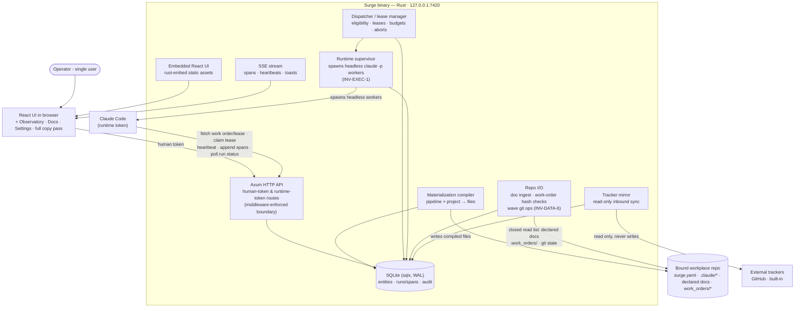

# Phase 3 — Observe: observatory & operations

**Status:** not_started
**Commitment level:** Phase 3 — ships to the operator; completes the V3 design surface.
**Time horizon:** ~3–4 weeks

## Purpose

Close the loop from execution back into authoring: the Observatory (waterfall, COE records, ratchets), the doc-chain surface, metrics, retention, and the operational surfaces (settings, backup, token rotation). Tests the assumption that observed failures can *ratchet* into pipeline improvements — the method's flywheel.

## In scope

1. Observatory: run list, span waterfall with policy decisions, node jumps, data-in/out pane (design §16).
2. COE records with the ratchet flow — suggested tightening applied against the next pipeline version (design §03).
3. Project·Docs surface: doc chain, gates, reading drawer, parent-change badges with re-derive (design §13).
4. Metrics: the three measured (status, latency, cost) and cost-by-role rollups (design §06). The metrics rail ships with the measured trio and the §16 honesty note; the provisional slots render as "not yet measured — COE labels accumulating".
5. Replay and the pipeline debugger (topological stepping, breakpoints) with their calibration disclaimers.
6. Retention/compaction: bodies compacted per policy, structure kept forever, compacted placeholders, replay refusal (INV-OBS-2, design §23-Five).
7. Settings, both levels: appearance, subagent roster, tokens + rotation, credentials, egress allowlist editor, backup/restore (design §17).
8. Empty/degraded/refusal state pass across all surfaces (design §20–§21 copy inventory).

## Out of scope

- Multi-runtime support (Cursor, Codex adapters) → post-V3 backlog
- Linear mirror implementation → post-V3 backlog
- Template push-back from project canvases → cut per design §23-One (promote-to-fork shipped in Phase 1)
- Provisional-metric *values* (decomposition quality, pass@k, pass^k, verifier false-positive) → post-V3 (audit 2026-08-12: at n=1 operator with three fixtures these are noise; the §16 surface ships, the numbers wait for a label source. The COE/ratchet flow — the actual flywheel — ships in full.)
- Real metric calibration from COE verdicts (labels accumulate; calibration is future work) → post-V3
- Node evals beyond the disclaimed deterministic panel → post-V3
- Instance-level model role bindings surface (state exists, no surface — design §23 "Designed but not wired") → post-V3
- Frames/stickies code-round-trip fidelity → post-V3
- Any multi-user, remote or SaaS capability → never in this product line (spec non-goals)

## Done when

- A failed run's waterfall shows the failing span, its policy decision, and jumps to the emitting node; a COE written on it suggests a ratchet that, when applied, produces a new pipeline version with the tightening in place.
- A parent doc edited after a child's approval badges the child with both hashes and offers re-derive; approval resets on completion.
- A span past the retention window shows the compacted placeholder; replay of its run is refused with the reason string (INV-OBS-2).
- Token rotation signs other browsers out; backup produces a restorable file; both audit-logged (INV-OBS-1).
- Every empty, degraded and refusal state in the design §21 copy inventory renders its exact string.

## Architecture (this phase)

Identical container set to Phase 2 — Phase 3 adds surfaces and policies, not containers. This matches the full [`docs/product/architecture.md`](../../product/architecture.md) diagram; the UI node grows the Observatory/Docs/Settings surfaces and the binary gains a retention job inside the existing process.

## Anticipated specs

| Feature | Hint |
|---|---|
| observatory-waterfall | run list, span tree, policy decisions, node jumps, data pane |
| coe-and-ratchet | COE records, ratchet suggestion + apply-to-next-version |
| docs-surface | chain view, gates, reading drawer, parent-change/re-derive |
| metrics | measured trio, cost-by-role, "not yet measured" provisional slots, disclaimers |
| replay-debugger | replay semantics, topological stepper, breakpoints, disclaimers |
| retention | compaction job, placeholder rendering, replay refusal |
| settings-operations | both settings levels, token rotation, credentials, egress editor, backup/restore |
| state-copy-pass | empty/degraded/refusal states audit against §20–§21 |

## Scoping assumptions

- scoping assumption — verify at spec time: replay can be implemented as re-dispatch of a recorded span's input against the same materialization hash, without a live process attachment.
- scoping assumption — verify at spec time: SQLite is adequate for span-body compaction in place (UPDATE-and-vacuum) without a separate blob store.
