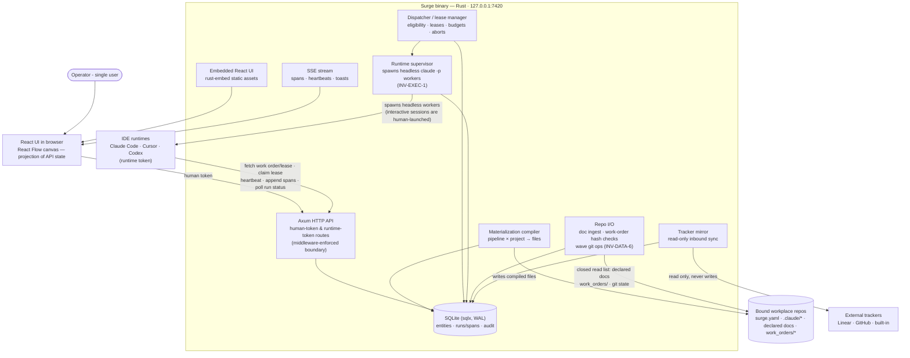

# Surge — Architecture

C4 container level. This diagram and the "Architecture (prose)" section of [`spec.md`](spec.md) are dual representations of the same intent and must agree exactly.

## Container diagram

## Reading the diagram

Everything stateful lives in one SQLite file inside one Rust process. Repo traffic is deliberate and narrow in both directions: the compiler writes the four closed-list file kinds (INV-DATA-1), repo I/O reads the three closed-list sources (INV-DATA-6), and nothing is ever written to trackers. Headless workers exist only because the runtime supervisor spawned them for a leased issue (INV-EXEC-1); interactive sessions are human-launched and merely claim leases. The two inbound client kinds map to the two tokens: the browser UI holds the human token with full control; IDE runtimes hold a per-project runtime token limited to five capabilities — fetch work order/lease, claim lease, heartbeat, append spans, poll own-run status — the gap enforced at the API, never in the UI.

## ADRs

### ADR-1 — Rust server, React UI, split at a generated-types seam
**Decision:** server in Rust (Axum, sqlx); UI in React with React Flow; TypeScript types generated from Rust structs via `ts-rs`.
**Alternatives rejected:** all-TypeScript (weaker compile-time guarantees where the correctness-critical logic lives — leases, gates, trust, hashing); all-Rust UI via egui/Leptos (no viable node-graph editor; the canvas is only affordable with React Flow).
**Why:** the server is a correctness-heavy state machine and the operator reviews Rust more confidently; the UI is a derivative projection where ecosystem maturity wins. `ts-rs` makes Rust the single source of truth so the two cannot drift.

### ADR-2 — SQLite via sqlx, single file, WAL
**Decision:** all persistence in one SQLite database accessed with compile-time-checked sqlx queries.
**Alternatives rejected:** Postgres (a second process for a single-user loopback tool); an ORM (runtime query construction defeats the compiler-reviews-it preference).
**Why:** single-operator local service is SQLite's home turf; append-heavy runs/spans/audit fit it; backup is file copy.

### ADR-3 — SSE for realtime, not WebSockets
**Decision:** server→UI streaming (spans, heartbeats, toasts) over `axum::response::sse`.
**Alternatives rejected:** WebSockets (bidirectional machinery the UI never needs — all mutations are ordinary authenticated HTTP calls).
**Why:** the Observatory only needs one-directional push; SSE reconnects for free and keeps the API surface plain HTTP.

### ADR-4 — Single static binary, UI embedded
**Decision:** `rust-embed` bundles the built Vite output; `cargo build` yields one binary, no Node at runtime.
**Alternatives rejected:** separate UI dev-server in production (two processes, port juggling); Electron/Tauri shell (the browser is already the shell).
**Why:** "one local service on one port" is the product frame; distribution and upgrade become copying one file.

### ADR-5 — Surge owns the actuator: a runtime supervisor spawns headless workers
**Decision:** the binary contains a runtime supervisor that spawns headless `claude -p` processes — one per dispatched issue holding a lease, capped by the phase's max-parallel. Interactive sessions remain human-launched and only claim leases (INV-EXEC-1).
**Alternatives rejected:** an external agent daemon polling for work (a fifth process nobody specified, breaking the one-binary frame); human-drained dispatch queue (reduces §06's queue policy, auto-retry and budgets to advisory fiction and makes Phase 2's acceptance criteria unsatisfiable).
**Why:** design §16 already records a dispatch kind of `headless claude -p` — Surge knowing how a run was launched only makes sense if it launched it. This narrows the spec non-goal: Surge never performs the creative work, but it does own process lifecycle. (design §23-Six)

### ADR-6 — A closed repo read path via a repo I/O component
**Decision:** all reads from bound repos go through one component with a closed list (INV-DATA-6): declared doc paths (ingested + hashed after a doc node's run; the repo file is canonical, Surge's copy the projection), `work_orders/` for hash-mismatch checks, and git state (shelling out to `git`) for wave integration.
**Alternatives rejected:** Surge-canonical docs with write-back (contradicts "the repo is the runtime's filesystem" and doubles the write surface); ad-hoc reads wherever needed (unauditable; the write list's discipline would be one-directional hypocrisy).
**Why:** the Docs drawer, work-order refusal and wave assembly each require reads the old one-way `compiler → repo` arrow could not supply; a single owned component keeps reads as reviewable as writes. (design §23-Seven)
