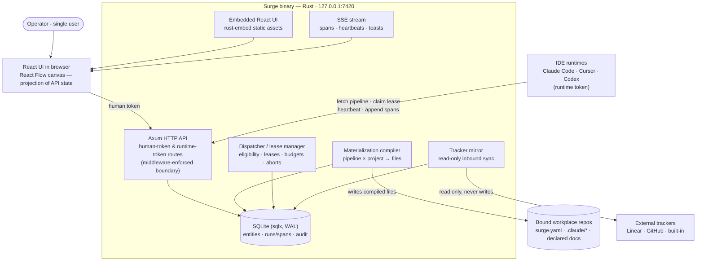

# Surge — Architecture

C4 container level. This diagram and the "Architecture (prose)" section of [`spec.md`](spec.md) are dual representations of the same intent and must agree exactly.

## Container diagram

## Reading the diagram

Everything stateful lives in one SQLite file inside one Rust process. The two external write paths are deliberate and narrow: the compiler into bound repos (three file kinds only), and nothing into trackers. The two inbound client kinds map to the two tokens: the browser UI holds the human token with full control; IDE runtimes hold a per-project runtime token limited to fetch/lease/heartbeat/append-spans — the gap enforced at the API, never in the UI.

## ADRs

### ADR-1 — Rust server, React UI, split at a generated-types seam
**Decision:** server in Rust (Axum, sqlx); UI in React with React Flow; TypeScript types generated from Rust structs via `ts-rs`.
**Alternatives rejected:** all-TypeScript (weaker compile-time guarantees where the correctness-critical logic lives — leases, gates, trust, hashing); all-Rust UI via egui/Leptos (no viable node-graph editor; the canvas is only affordable with React Flow).
**Why:** the server is a correctness-heavy state machine and the operator reviews Rust more confidently; the UI is a derivative projection where ecosystem maturity wins. `ts-rs` makes Rust the single source of truth so the two cannot drift.

### ADR-2 — SQLite via sqlx, single file, WAL
**Decision:** all persistence in one SQLite database accessed with compile-time-checked sqlx queries.
**Alternatives rejected:** Postgres (a second process for a single-user loopback tool); an ORM (runtime query construction defeats the compiler-reviews-it preference).
**Why:** single-operator local service is SQLite's home turf; append-heavy runs/spans/audit fit it; backup is file copy.

### ADR-3 — SSE for realtime, not WebSockets
**Decision:** server→UI streaming (spans, heartbeats, toasts) over `axum::response::sse`.
**Alternatives rejected:** WebSockets (bidirectional machinery the UI never needs — all mutations are ordinary authenticated HTTP calls).
**Why:** the Observatory only needs one-directional push; SSE reconnects for free and keeps the API surface plain HTTP.

### ADR-4 — Single static binary, UI embedded
**Decision:** `rust-embed` bundles the built Vite output; `cargo build` yields one binary, no Node at runtime.
**Alternatives rejected:** separate UI dev-server in production (two processes, port juggling); Electron/Tauri shell (the browser is already the shell).
**Why:** "one local service on one port" is the product frame; distribution and upgrade become copying one file.
