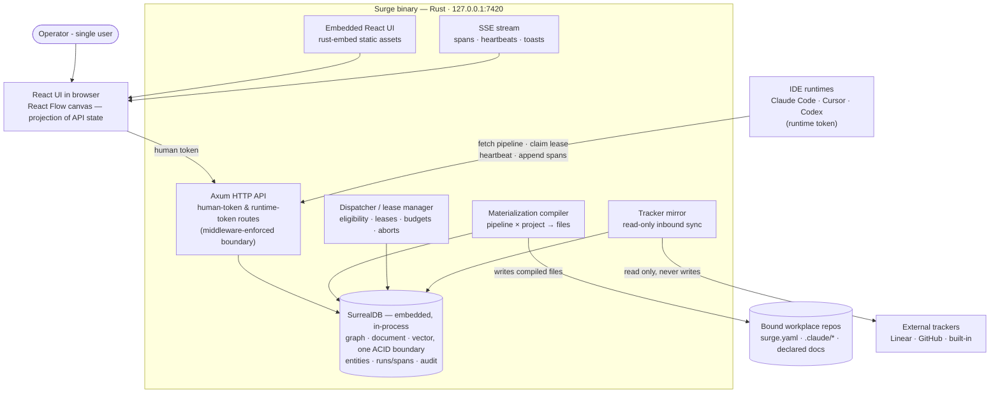

# Surge — Architecture

C4 container level. This diagram and the "Architecture (prose)" section of [`spec.md`](spec.md) are dual representations of the same intent and must agree exactly.

## Container diagram

## Reading the diagram

Everything stateful lives in one embedded SurrealDB instance inside one Rust process — no database server, no second port, no cache that can disagree with it (INV-DATA-6). The two external write paths are deliberate and narrow: the compiler into bound repos (three file kinds only), and nothing into trackers. The two inbound client kinds map to the two tokens: the browser UI holds the human token with full control; IDE runtimes hold a per-project runtime token limited to fetch/lease/heartbeat/append-spans — the gap enforced at the API, never in the UI.

## ADRs

### ADR-1 — Rust server, React UI, split at a generated-types seam
**Decision:** server in Rust (Axum, embedded SurrealDB); UI in React with React Flow; TypeScript types generated from Rust structs via `ts-rs`.
**Alternatives rejected:** all-TypeScript (weaker compile-time guarantees where the correctness-critical logic lives — leases, gates, trust, hashing); all-Rust UI via egui/Leptos (no viable node-graph editor; the canvas is only affordable with React Flow).
**Why:** the server is a correctness-heavy state machine and the operator reviews Rust more confidently; the UI is a derivative projection where ecosystem maturity wins. `ts-rs` makes Rust the single source of truth so the two cannot drift.

### ADR-2 — Embedded SurrealDB as the single store
*Supersedes the original ADR-2 (SQLite via sqlx, single file, WAL), 2026-08-18.*

**Decision:** all persistence in one embedded SurrealDB instance running inside the Surge process — `surrealdb` crate with `default-features = false`, `kv-rocksdb` for the durable store and `kv-mem` for tests. No database server, no second port. Tables are `SCHEMAFULL`; graph relationships are edge records (`RELATE a->edge->b SET …`), not join tables.

**Alternatives rejected:**
- *SQLite via sqlx* (the prior decision) — gives compile-time-checked queries, but the object model is a graph and SQLite makes you pay for that in application code: the pipeline node/edge DAG, the doc chain, the span tree and the taskgraph dependency waves all become recursive CTEs plus hand-maintained closure tables, and design §672's cross-surface navigation is graph traversal under another name.
- *Postgres with pgvector/AGE* — a second process for a single-user loopback tool; violates INV-DEPLOY-1.
- *SurrealDB as a sidecar server process* — breaks ADR-4's one-binary distribution and opens a second listener.
- *SQLite plus a derived SurrealDB recall store* — pays the embedded-SurrealDB build cost anyway while keeping two transaction boundaries; the divergence it permits is exactly what INV-DATA-6 exists to forbid.

**Why:** the twelve entities are a graph and SurrealDB stores edges as records carrying their own properties, traversable recursively in one statement. Everything a write touches — entity, run, span, audit row — commits in one ACID boundary, so an approve or a compile cannot half-land. `LIVE SELECT` on the local engine drives the SSE stream from the engine instead of a hand-rolled broadcast bus (ADR-3), and in-engine HNSW indexes are there when Phase 3 wants semantic recall over run history.

**Consequences — accepted, with mitigations:**
- **No compile-time query checking.** SurrealQL is parsed at runtime; the `query!` macro is an open upstream request ([surrealdb#2694](https://github.com/surrealdb/surrealdb/issues/2694)). This lands squarely on ADR-1's stated reason for choosing Rust, and it is the real price of this decision. Mitigation is structural, not optional: every query lives in `crates/store` behind a typed repository function with a `kv-mem` integration test, and that suite is treated as the build-time check it replaces. Lease, gate, trust and hash paths are `role:critical`.
- **Build weight.** `surrealdb-core` pulls on the order of 700 crates, with long cold builds reported upstream ([surrealdb#6954](https://github.com/surrealdb/surrealdb/issues/6954)). Mitigation: default features off, `protocol-ws` and `rustls` disabled — nothing connects over a network. Phase 0 measures cold-build time and stripped binary size in its first task and records them; a blown budget is a stop-and-reconsider trigger, not a shrug.
- **Storage engine: RocksDB, not versioned SurrealKV.** SurrealKV offers `VERSION` time-travel but is beta, and engine-level version retention is in direct tension with INV-OBS-2, which requires compaction to *actually* drop span bodies. Surge models its own history explicitly — immutable library versions, content-hashed materializations, an audit table — so it does not need the engine to do it. Time travel stays a deferred option, not a dependency.
- **Licensing.** SurrealDB core is BSL 1.1: embedding it in an application you ship is expressly permitted; only offering it as a managed service is restricted. Version 3.0 converts to Apache 2.0 on 2030-01-01. Surge is a local single-user binary, comfortably inside the grant.

### ADR-3 — SSE for realtime, not WebSockets
**Decision:** server→UI streaming (spans, heartbeats, toasts) over `axum::response::sse`, sourced from `LIVE SELECT` subscriptions on the embedded engine.
**Alternatives rejected:** WebSockets (bidirectional machinery the UI never needs — all mutations are ordinary authenticated HTTP calls).
**Why:** the Observatory only needs one-directional push; SSE reconnects for free and keeps the API surface plain HTTP. Under ADR-2 the server no longer maintains its own fan-out bus: it subscribes to the tables the UI cares about and forwards notifications, so a span is streamed because it was *committed*, not because a writer remembered to publish it. `LIVE SELECT` is supported on local engines and is single-node only, which is Surge's shape by INV-DEPLOY-1.

### ADR-5 — Schema defined in Rust, applied idempotently at startup
**Decision:** the `SCHEMAFULL` table, field, index and relation definitions live as SurrealQL in `crates/store`, applied with `IF NOT EXISTS` at process start and stamped with a `schema_version` record. No external migration tool.
**Alternatives rejected:** `surrealdb-migrations` (a third-party CLI in the boot path of a single-binary product); implicit `SCHEMALESS` tables (an unenforced object model is how INV-* rules rot into comments).
**Why:** ADR-4 says the product is one file you copy — so schema application belongs inside it, at boot, not in a separate step an operator can forget. `SCHEMAFULL` keeps the twelve entities enforced at the engine rather than by convention, which is what makes `crates/domain` the single source of truth that `ts-rs` projects into TypeScript.

### ADR-4 — Single static binary, UI embedded
**Decision:** `rust-embed` bundles the built Vite output; `cargo build` yields one binary, no Node at runtime.
**Alternatives rejected:** separate UI dev-server in production (two processes, port juggling); Electron/Tauri shell (the browser is already the shell).
**Why:** "one local service on one port" is the product frame; distribution and upgrade become copying one file.
