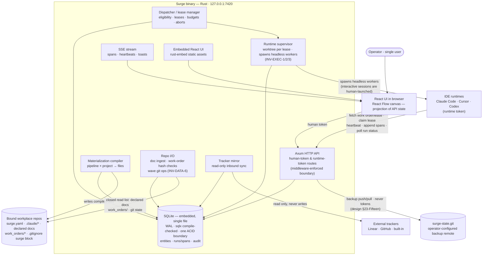

# Surge — Architecture

C4 container level. This diagram and the "Architecture (prose)" section of [`spec.md`](spec.md) are dual representations of the same intent and must agree exactly.

## Container diagram

## Reading the diagram

Everything stateful lives in one embedded SQLite database inside one Rust process — no database server, no second port, no cache that can disagree with it (INV-DATA-8). External traffic is deliberate and narrow in every direction: the compiler writes the five closed-list file kinds (INV-DATA-1, committed vs. gitignored per INV-DATA-7 — the fifth being the surge-managed block inside the repo-root `.gitignore`, enumerated 2026-08-26), repo I/O reads the three closed-list sources (INV-DATA-6), nothing is ever written to trackers, and the only other outbound path is the operator-configured backup remote — which never carries tokens. Headless workers exist only because the runtime supervisor spawned them for a leased issue (INV-EXEC-1); interactive sessions are human-launched and merely claim leases. The two inbound client kinds map to the two tokens: the browser UI holds the human token with full control; IDE runtimes hold a per-project runtime token limited to five capabilities — fetch work order/lease, claim lease, heartbeat, append spans, poll own-run status — the gap enforced at the API, never in the UI.

## ADRs

### ADR-1 — Rust server, React UI, split at a generated-types seam
**Decision:** server in Rust (Axum, embedded SQLite); UI in React with React Flow; TypeScript types generated from Rust structs via `ts-rs`.
**Alternatives rejected:** all-TypeScript (weaker compile-time guarantees where the correctness-critical logic lives — leases, gates, trust, hashing); all-Rust UI via egui/Leptos (no viable node-graph editor; the canvas is only affordable with React Flow).
**Why:** the server is a correctness-heavy state machine and the operator reviews Rust more confidently; the UI is a derivative projection where ecosystem maturity wins. `ts-rs` makes Rust the single source of truth so the two cannot drift.

### ADR-2 — SQLite via sqlx as the single store
*Supersedes the embedded-SurrealDB ADR-2 of 2026-08-18, on 2026-08-25 — returning to the original 2026-08-08 decision, this time with the graph question answered rather than deferred.*

**Decision:** all persistence in one SQLite database file owned by the Surge process — `sqlx` with compile-time-checked queries (`query!`/`query_as!`, offline metadata committed via `cargo sqlx prepare`), WAL mode, foreign keys enforced, one writer connection plus a read pool. Graph relationships are ordinary edge tables traversed with recursive CTEs behind typed repository functions. Vector recall, when Phase 3 wants it, is the `sqlite-vec` extension — deferred, not scaffolded.

**Alternatives rejected:**
- *Embedded SurrealDB* (the 2026-08-18 decision) — bought traversal ergonomics (`RELATE`, recursive edge syntax) and engine-sourced live queries at three costs that all land on the wrong paths: runtime-parsed queries on exactly the lease/gate/trust/hash code ADR-1 chose Rust to protect (the mitigation was a test suite standing in for a compiler); ~700 crates of build weight with a stop-and-reconsider budget attached; and a young embedded engine underneath the audit trail, where boring is the requirement. Everything it uniquely offered has a cheap substitute (see Why).
- *Postgres with pgvector/AGE* — a second process for a single-user loopback tool; violates INV-DEPLOY-1.
- *SQLite plus a derived recall/graph store* — two transaction boundaries; the divergence it permits is exactly what INV-DATA-8 forbids.

**Why:** at single-operator scale the twelve-entity graph is hundreds of rows, not millions — the pipeline DAG, doc chains, span trees and taskgraph waves are shallow, mostly append-only structures that recursive CTEs traverse in microseconds without hand-maintained closure tables (the 2026-08-18 ADR's stated fear, retracted on inspection: pinned versions and immutable published revisions keep the graphs from ever needing incremental closure maintenance). What SQLite uniquely restores is compile-time query checking on the correctness-critical paths — `sqlx` verifies every query against the schema at build time, which is the guarantee ADR-1 chose Rust for — and the most battle-tested storage engine available sitting under the audit log, hashes and lease state. The two features that tipped the SurrealDB decision substitute cheaply: `LIVE SELECT` → a `tokio::sync::broadcast` fired inside the same repository function that commits the transaction (a span still streams because it was *committed* — the discipline holds because every write already goes through `crates/store`); in-engine HNSW → `sqlite-vec` when semantic recall actually lands.

**Consequences — accepted, with mitigations:**
- **Graph traversal is SQL.** Recursive CTEs live behind typed repository functions like every other query, compile-checked like every other query. If profiling ever demands a closure table, it is a derived index rebuilt inside the same transaction as its source rows — never a second source of truth (INV-DATA-8).
- **The event bus is hand-rolled again** (ADR-3 amended). Commit-then-broadcast inside the repository function; the failure mode of a forgotten broadcast is a stale UI, not corrupt data, and each repo-function test asserts its emission alongside its rows.
- **Write concurrency is single-writer.** WAL gives concurrent readers; writes serialize on one connection. At one operator plus a handful of heartbeating workers this is far below contention range; `busy_timeout` covers the rest.
- **Offline query metadata is a build artefact.** The committed `.sqlx/` directory must be regenerated when the schema changes; CI-less Phase 0 enforces it by convention, a `cargo sqlx prepare --check` hook when CI lands.

### ADR-3 — SSE for realtime, not WebSockets
**Decision:** server→UI streaming (spans, heartbeats, toasts) over `axum::response::sse`, sourced from `tokio::sync::broadcast` channels fired by the repository layer at commit. *(2026-08-25: source amended from SurrealDB `LIVE SELECT` alongside the ADR-2 reversal.)*
**Alternatives rejected:** WebSockets (bidirectional machinery the UI never needs — all mutations are ordinary authenticated HTTP calls).
**Why:** the Observatory only needs one-directional push; SSE reconnects for free and keeps the API surface plain HTTP. The commit-then-broadcast call lives inside the typed repository function that performs the write, so a span is streamed because it was *committed*, not because a caller remembered to publish it — the property previously delegated to `LIVE SELECT`, now guaranteed by the same `crates/store` discipline that owns every query.

### ADR-4 — Single static binary, UI embedded
**Decision:** `rust-embed` bundles the built Vite output; `cargo build` yields one binary, no Node at runtime.
**Alternatives rejected:** separate UI dev-server in production (two processes, port juggling); Electron/Tauri shell (the browser is already the shell).
**Why:** "one local service on one port" is the product frame; distribution and upgrade become copying one file.

### ADR-5 — Surge owns the actuator: a runtime supervisor spawns headless workers
**Decision:** the binary contains a runtime supervisor that spawns headless `claude -p` processes — one per dispatched issue holding a lease, capped by the phase's max-parallel. Interactive sessions remain human-launched and only claim leases (INV-EXEC-1).
**Alternatives rejected:** an external agent daemon polling for work (a fifth process nobody specified, breaking the one-binary frame); human-drained dispatch queue (reduces §06's queue policy, auto-retry and budgets to advisory fiction and makes Phase 2's acceptance criteria unsatisfiable).
**Why:** design §16 already records a dispatch kind of `headless claude -p` — Surge knowing how a run was launched only makes sense if it launched it. This narrows the spec non-goal: Surge never performs the creative work, but it does own process lifecycle. (design §23-Six)

### ADR-6 — A closed repo read path via a repo I/O component
**Decision:** all reads from bound repos go through one component with a closed list (INV-DATA-6): declared doc paths (ingested + hashed after a doc node's run; the repo file is canonical, Surge's copy the projection), `work_orders/` for hash-mismatch checks, and git state (shelling out to `git`) for wave integration.
**Alternatives rejected:** Surge-canonical docs with write-back (contradicts "the repo is the runtime's filesystem" and doubles the write surface); ad-hoc reads wherever needed (unauditable; the write list's discipline would be one-directional hypocrisy).
**Why:** the Docs drawer, work-order refusal and wave assembly each require reads the old one-way `compiler → repo` arrow could not supply; a single owned component keeps reads as reviewable as writes. (design §23-Seven)

### ADR-7 — Worktree-per-lease worker isolation
**Decision:** claiming a lease creates a git worktree on the issue's task branch; the supervisor spawns the worker inside it, compiles the materialization into it (compiled files are gitignored per INV-DATA-7), and reaps it at lease end (INV-EXEC-2).
**Alternatives rejected:** shared working directory (parallel workers clobber each other; "max 3 parallel" would be unsafe by construction); full clones per worker (disk and clone latency for no isolation gain over worktrees).
**Why:** worktrees give branch-isolated filesystems sharing one object store — exactly the wave-integration model, which rebases the task branches the worktrees produced. (design §23-Ten)

### ADR-8 — Claude Code plugin over MCP as the runtime integration
**Decision:** the primary runtime integration is a Claude Code plugin (`integrations/claude-plugin/`) bundling an MCP server that exposes the five runtime-token capabilities as typed tools plus the span/guard hooks; compiled `.claude/settings.json` registers it. Raw hook-script HTTP glue is the fallback for MCP-less runtimes.
**Alternatives rejected:** hook-scripts-only (shell glue, no typed contract, fragile across runtime versions — kept only as fallback); forking or wrapping the runtime binary (maintenance treadmill, breaks "runtimes are thin clients").
**Why:** Claude Code speaks MCP natively, so the riskiest Phase 0 assumption (hooks can implement fetch/spans/abort-poll) gets a supported protocol instead of curl; and one MCP server is the reusable template for the post-V3 Cursor/Codex adapters. (design §23-Eighteen)

*2026-08-25 — packaging settled (smoke re-walk NEW-1):* the plugin tree is embedded in the binary via `rust-embed` alongside the UI and extracted to `<db-dir>/.surge/plugin/<version>` at boot, so ADR-4's one-file distribution covers the actuator too and `SURGE_PLUGIN_DIR` resolves regardless of the operator's cwd. `--plugin-dir` overrides it for development. The supervisor verifies the tree's MCP entry point before every spawn and refuses loudly if it is absent: a worker without tools or hooks emits no spans, never heartbeats and cannot see an abort, yet `claude -p` still exits 0 — so an unverified spawn would report success with nothing behind it.

### ADR-9 — Schema defined in Rust, applied idempotently at startup
**Decision:** the schema lives as SQL migrations in `crates/store`, embedded in the binary via `sqlx::migrate!` and applied at process start; sqlx's migrations table is the schema-version stamp. No external migration tool. *(2026-08-25: restated from SurrealQL `SCHEMAFULL` definitions alongside the ADR-2 reversal — the principle is unchanged, only the dialect.)*
**Alternatives rejected:** a standalone migration CLI (a second tool in the boot path of a single-binary product); schemaless/JSON-blob tables (an unenforced object model is how INV-* rules rot into comments).
**Why:** ADR-4 says the product is one file you copy — so schema application belongs inside it, at boot, not in a separate step an operator can forget. Typed columns, foreign keys and CHECK constraints keep the twelve entities enforced at the engine rather than by convention, which is what makes `crates/domain` the single source of truth that `ts-rs` projects into TypeScript.
